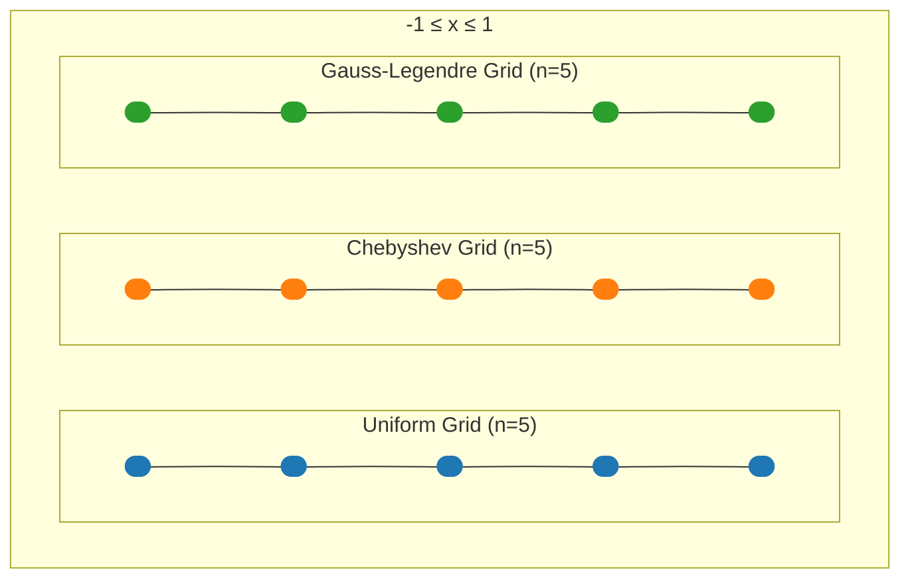
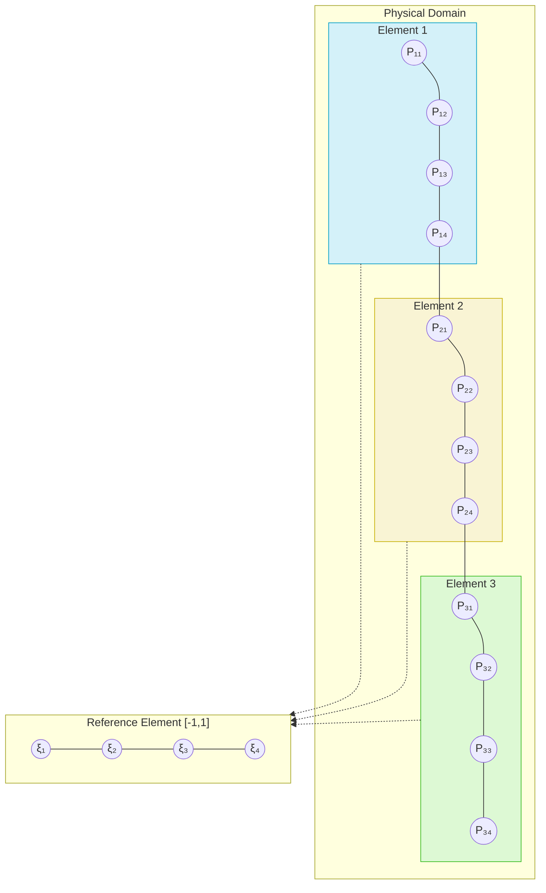

# Geometric Interpretation Template

This template provides a standardized way to visualize the geometric interpretation of mathematical concepts, essential for understanding spectral methods, discretization approaches, and solution properties in a spatial context.

## Basic Geometric Visualization Structure

```svg
<svg width="600" height="400" viewBox="0 0 600 400" xmlns="http://www.w3.org/2000/svg">
    <!-- Background and border -->
    <rect x="0" y="0" width="600" height="400" fill="#f8f9fa" />
    <rect x="40" y="40" width="520" height="320" fill="white" stroke="#ddd" stroke-width="1" />
    
    <!-- Title -->
    <text x="300" y="25" font-family="Arial" font-size="16" text-anchor="middle" font-weight="bold">Geometric Interpretation: [Concept Name]</text>
    
    <!-- Main geometric elements will go here -->
    <!-- Example: Generic domain representation -->
    <rect x="100" y="100" width="400" height="200" fill="#e6f7ff" stroke="#1f77b4" stroke-width="2" rx="10" ry="10" />
    
    <!-- Example: Points within domain -->
    <circle cx="150" cy="150" r="5" fill="#ff7f0e" />
    <circle cx="250" cy="200" r="5" fill="#ff7f0e" />
    <circle cx="350" cy="150" r="5" fill="#ff7f0e" />
    <circle cx="450" cy="250" r="5" fill="#ff7f0e" />
    
    <!-- Example: Line connecting points -->
    <polyline points="150,150 250,200 350,150 450,250" fill="none" stroke="#ff7f0e" stroke-width="2" stroke-dasharray="5,5" />
    
    <!-- Labels -->
    <text x="150" y="140" font-family="Arial" font-size="12" text-anchor="middle">P₁</text>
    <text x="250" y="190" font-family="Arial" font-size="12" text-anchor="middle">P₂</text>
    <text x="350" y="140" font-family="Arial" font-size="12" text-anchor="middle">P₃</text>
    <text x="450" y="240" font-family="Arial" font-size="12" text-anchor="middle">P₄</text>
    
    <!-- Annotations -->
    <text x="300" y="120" font-family="Arial" font-size="14" text-anchor="middle" font-style="italic">Domain Ω</text>
    
    <!-- Legend -->
    <rect x="450" y="50" width="100" height="75" fill="white" stroke="#ddd" stroke-width="1" />
    <circle cx="465" y="70" r="5" fill="#ff7f0e" />
    <text x="480" y="74" font-family="Arial" font-size="12">Sample Points</text>
    <line x1="455" y1="95" x2="475" y2="95" stroke="#ff7f0e" stroke-width="2" stroke-dasharray="5,5" />
    <text x="480" y="99" font-family="Arial" font-size="12">Interpolation</text>
    <rect x="455" y="110" width="20" height="10" fill="#e6f7ff" stroke="#1f77b4" stroke-width="1" />
    <text x="480" y="119" font-family="Arial" font-size="12">Domain</text>
</svg>
```

For more complex geometrical interpretations, consider interactive visualizations with D3.js or Three.js through React components:

```jsx
import React, { useRef, useEffect } from 'react';
import * as d3 from 'd3';

const CollocationPointsVisualization = () => {
  const svgRef = useRef();
  
  useEffect(() => {
    if (!svgRef.current) return;
    
    // Clear any existing visualization
    d3.select(svgRef.current).selectAll('*').remove();
    
    // Setup svg and dimensions
    const width = 600;
    const height = 400;
    const margin = { top: 40, right: 40, bottom: 40, left: 40 };
    const innerWidth = width - margin.left - margin.right;
    const innerHeight = height - margin.top - margin.bottom;
    
    // Create svg
    const svg = d3.select(svgRef.current)
      .attr('width', width)
      .attr('height', height)
      .append('g')
      .attr('transform', `translate(${margin.left},${margin.top})`);
    
    // Add title
    svg.append('text')
      .attr('x', innerWidth / 2)
      .attr('y', -20)
      .attr('text-anchor', 'middle')
      .attr('font-family', 'Arial')
      .attr('font-size', '16px')
      .attr('font-weight', 'bold')
      .text('Gauss-Legendre Collocation Points');
    
    // Setup scales
    const xScale = d3.scaleLinear()
      .domain([-1, 1])
      .range([0, innerWidth]);
    
    const yScale = d3.scaleLinear()
      .domain([-0.2, 1.2])
      .range([innerHeight, 0]);
    
    // Draw axes
    const xAxis = d3.axisBottom(xScale);
    svg.append('g')
      .attr('transform', `translate(0,${innerHeight/2})`)
      .call(xAxis);
    
    // Add x-axis label
    svg.append('text')
      .attr('x', innerWidth / 2)
      .attr('y', innerHeight + 30)
      .attr('text-anchor', 'middle')
      .text('x');
    
    // Domain representation ([-1,1] interval)
    svg.append('line')
      .attr('x1', xScale(-1))
      .attr('y1', yScale(0))
      .attr('x2', xScale(1))
      .attr('y2', yScale(0))
      .attr('stroke', '#1f77b4')
      .attr('stroke-width', 3);
    
    // Generate collocation points for different orders
    const generatePoints = (n) => {
      // This is a simplified approximation of Gauss-Legendre points
      // In practice, you would compute these more accurately
      const points = [];
      for (let i = 0; i < n; i++) {
        const x = -Math.cos((2*i + 1) * Math.PI / (2*n));
        points.push(x);
      }
      return points.sort((a, b) => a - b);
    };
    
    // Create point sets
    const pointSets = [
      { n: 3, color: '#1f77b4', y: 0.2 },
      { n: 5, color: '#ff7f0e', y: 0.5 },
      { n: 7, color: '#2ca02c', y: 0.8 }
    ];
    
    // Plot points and labels
    pointSets.forEach(set => {
      const points = generatePoints(set.n);
      
      // Add points
      svg.selectAll(`.points-n${set.n}`)
        .data(points)
        .enter()
        .append('circle')
        .attr('cx', d => xScale(d))
        .attr('cy', yScale(set.y))
        .attr('r', 5)
        .attr('fill', set.color);
      
      // Add level label
      svg.append('text')
        .attr('x', xScale(-1) - 20)
        .attr('y', yScale(set.y))
        .attr('alignment-baseline', 'middle')
        .attr('font-family', 'Arial')
        .attr('font-size', '12px')
        .text(`n = ${set.n}`);
    });
    
    // Add legend
    const legend = svg.append('g')
      .attr('transform', `translate(${innerWidth - 100}, 20)`);
    
    legend.append('rect')
      .attr('width', 100)
      .attr('height', 80)
      .attr('fill', 'white')
      .attr('stroke', '#ddd');
    
    pointSets.forEach((set, i) => {
      legend.append('circle')
        .attr('cx', 10)
        .attr('cy', 20 + i * 20)
        .attr('r', 5)
        .attr('fill', set.color);
      
      legend.append('text')
        .attr('x', 20)
        .attr('y', 23 + i * 20)
        .attr('font-family', 'Arial')
        .attr('font-size', '12px')
        .text(`n = ${set.n} points`);
    });
    
  }, []);
  
  return (
    <div className="geometric-visualization">
      <svg ref={svgRef}></svg>
      <div className="visualization-description">
        <p>This figure shows the distribution of Gauss-Legendre collocation points in the domain [-1,1] for different polynomial degrees.</p>
        <p>As the polynomial degree increases, the points cluster more densely near the boundaries, optimizing the approximation properties.</p>
      </div>
    </div>
  );
};
```

## Visualization Types for Different Concepts

### Collocation Points and Grids

Clearly visualize the distribution of collocation points in the computational domain:



### Spectral Element Domains

Illustrate how domains are decomposed in spectral element methods:



### Moving Boundary Transformation

For moving boundary methods, illustrate the coordinate transformation:

```jsx
import React, { useRef, useEffect, useState } from 'react';
import * as d3 from 'd3';

const MovingBoundaryVisualization = () => {
  const svgRef = useRef();
  const [time, setTime] = useState(0);
  
  // Define boundary movement
  const boundaryPosition = (t) => 1 + 0.3 * Math.sin(t);
  
  useEffect(() => {
    if (!svgRef.current) return;
    
    // Clear any existing visualization
    d3.select(svgRef.current).selectAll('*').remove();
    
    // Setup svg and dimensions
    const width = 700;
    const height = 300;
    const margin = { top: 40, right: 100, bottom: 40, left: 60 };
    const innerWidth = width - margin.left - margin.right;
    const innerHeight = height - margin.top - margin.bottom;
    
    // Create svg
    const svg = d3.select(svgRef.current)
      .attr('width', width)
      .attr('height', height)
      .append('g')
      .attr('transform', `translate(${margin.left},${margin.top})`);
    
    // Add title
    svg.append('text')
      .attr('x', innerWidth / 2)
      .attr('y', -20)
      .attr('text-anchor', 'middle')
      .attr('font-family', 'Arial')
      .attr('font-size', '16px')
      .attr('font-weight', 'bold')
      .text('Moving Boundary Transformation');
    
    // Setup scales for physical domain
    const xScalePhysical = d3.scaleLinear()
      .domain([0, 2])
      .range([0, innerWidth * 0.45]);
    
    const yScalePhysical = d3.scaleLinear()
      .domain([0, 1])
      .range([innerHeight, 0]);
    
    // Setup scales for computational domain
    const xScaleComp = d3.scaleLinear()
      .domain([0, 1])
      .range([innerWidth * 0.55, innerWidth]);
    
    const yScaleComp = d3.scaleLinear()
      .domain([0, 1])
      .range([innerHeight, 0]);
    
    // Draw physical domain grid
    const physicalDomain = svg.append('g')
      .attr('class', 'physical-domain');
    
    // Physical domain box
    const sPosition = boundaryPosition(time);
    physicalDomain.append('rect')
      .attr('x', xScalePhysical(0))
      .attr('y', yScalePhysical(1))
      .attr('width', xScalePhysical(sPosition) - xScalePhysical(0))
      .attr('height', yScalePhysical(0) - yScalePhysical(1))
      .attr('fill', '#d4f1f9')
      .attr('stroke', '#05a0c8')
      .attr('stroke-width', 2);
    
    // Physical domain label
    physicalDomain.append('text')
      .attr('x', xScalePhysical(sPosition/2))
      .attr('y', yScalePhysical(0.5))
      .attr('text-anchor', 'middle')
      .attr('font-family', 'Arial')
      .attr('font-size', '14px')
      .text('Physical Domain');
    
    // Physical domain axes
    physicalDomain.append('line')
      .attr('x1', xScalePhysical(0))
      .attr('y1', yScalePhysical(0))
      .attr('x2', xScalePhysical(2))
      .attr('y2', yScalePhysical(0))
      .attr('stroke', 'black')
      .attr('stroke-width', 1);
    
    physicalDomain.append('line')
      .attr('x1', xScalePhysical(0))
      .attr('y1', yScalePhysical(0))
      .attr('x2', xScalePhysical(0))
      .attr('y2', yScalePhysical(1))
      .attr('stroke', 'black')
      .attr('stroke-width', 1);
    
    // Axis labels
    physicalDomain.append('text')
      .attr('x', xScalePhysical(1))
      .attr('y', yScalePhysical(0) + 20)
      .attr('text-anchor', 'middle')
      .attr('font-family', 'Arial')
      .attr('font-size', '12px')
      .text('x');
    
    // Draw moving boundary
    physicalDomain.append('line')
      .attr('x1', xScalePhysical(sPosition))
      .attr('y1', yScalePhysical(0))
      .attr('x2', xScalePhysical(sPosition))
      .attr('y2', yScalePhysical(1))
      .attr('stroke', '#d62728')
      .attr('stroke-width', 2)
      .attr('stroke-dasharray', '5,3');
    
    physicalDomain.append('text')
      .attr('x', xScalePhysical(sPosition) + 5)
      .attr('y', yScalePhysical(0.9))
      .attr('font-family', 'Arial')
      .attr('font-size', '12px')
      .text('s(t)');
    
    // Draw computational domain grid
    const compDomain = svg.append('g')
      .attr('class', 'computational-domain');
    
    // Computational domain box
    compDomain.append('rect')
      .attr('x', xScaleComp(0))
      .attr('y', yScaleComp(1))
      .attr('width', xScaleComp(1) - xScaleComp(0))
      .attr('height', yScaleComp(0) - yScaleComp(1))
      .attr('fill', '#ddf9d4')
      .attr('stroke', '#3dbd25')
      .attr('stroke-width', 2);
    
    // Computational domain label
    compDomain.append('text')
      .attr('x', xScaleComp(0.5))
      .attr('y', yScaleComp(0.5))
      .attr('text-anchor', 'middle')
      .attr('font-family', 'Arial')
      .attr('font-size', '14px')
      .text('Computational Domain');
    
    // Computational domain axes
    compDomain.append('line')
      .attr('x1', xScaleComp(0))
      .attr('y1', yScaleComp(0))
      .attr('x2', xScaleComp(1))
      .attr('y2', yScaleComp(0))
      .attr('stroke', 'black')
      .attr('stroke-width', 1);
    
    compDomain.append('line')
      .attr('x1', xScaleComp(0))
      .attr('y1', yScaleComp(0))
      .attr('x2', xScaleComp(0))
      .attr('y2', yScaleComp(1))
      .attr('stroke', 'black')
      .attr('stroke-width', 1);
    
    // Axis labels
    compDomain.append('text')
      .attr('x', xScaleComp(0.5))
      .attr('y', yScaleComp(0) + 20)
      .attr('text-anchor', 'middle')
      .attr('font-family', 'Arial')
      .attr('font-size', '12px')
      .text('η');
    
    // Draw fixed boundary
    compDomain.append('line')
      .attr('x1', xScaleComp(1))
      .attr('y1', yScaleComp(0))
      .attr('x2', xScaleComp(1))
      .attr('y2', yScaleComp(1))
      .attr('stroke', '#d62728')
      .attr('stroke-width', 2);
    
    // Draw sample points (for illustration)
    const numPoints = 5;
    const physicalPoints = Array.from({length: numPoints}, (_, i) => 
      sPosition * (i / (numPoints - 1))
    );
    
    const compPoints = Array.from({length: numPoints}, (_, i) => 
      i / (numPoints - 1)
    );
    
    // Draw lines connecting corresponding points
    for (let i = 0; i < numPoints; i++) {
      // Physical domain point
      physicalDomain.append('circle')
        .attr('cx', xScalePhysical(physicalPoints[i]))
        .attr('cy', yScalePhysical(0.5))
        .attr('r', 4)
        .attr('fill', '#ff7f0e');
      
      // Computational domain point
      compDomain.append('circle')
        .attr('cx', xScaleComp(compPoints[i]))
        .attr('cy', yScaleComp(0.5))
        .attr('r', 4)
        .attr('fill', '#ff7f0e');
      
      // Connection line
      if (i < numPoints - 1) {
        svg.append('path')
          .attr('d', `M ${xScalePhysical(physicalPoints[i])} ${yScalePhysical(0.5)} 
                      C ${xScalePhysical(sPosition) + 20} ${yScalePhysical(0.5)},
                        ${xScaleComp(0) - 20} ${yScaleComp(0.5)},
                        ${xScaleComp(compPoints[i])} ${yScaleComp(0.5)}`)
          .attr('stroke', '#9467bd')
          .attr('stroke-width', 1)
          .attr('fill', 'none')
          .attr('stroke-dasharray', '3,2');
      }
    }
    
    // Add transformation equation
    svg.append('text')
      .attr('x', (xScalePhysical(sPosition) + xScaleComp(0)) / 2)
      .attr('y', yScalePhysical(0.2))
      .attr('text-anchor', 'middle')
      .attr('font-family', 'Arial')
      .attr('font-size', '14px')
      .attr('font-style', 'italic')
      .text('x = η·s(t)');
    
    // Add current time indicator
    svg.append('text')
      .attr('x', xScalePhysical(0))
      .attr('y', yScalePhysical(1) - 20)
      .attr('font-family', 'Arial')
      .attr('font-size', '12px')
      .text(`Time: t = ${time.toFixed(2)}`);
    
  }, [time]);
  
  // Animation controls
  const handleTimeChange = (event) => {
    setTime(parseFloat(event.target.value));
  };
  
  return (
    <div className="moving-boundary-visualization">
      <svg ref={svgRef}></svg>
      <div className="time-control">
        <label htmlFor="time-slider">Time: {time.toFixed(2)}</label>
        <input
          id="time-slider"
          type="range"
          min="0"
          max="6.28"
          step="0.1"
          value={time}
          onChange={handleTimeChange}
        />
      </div>
      <div className="visualization-description">
        <p>This visualization demonstrates the coordinate transformation from a physical domain with a moving boundary to a fixed computational domain.</p>
        <p>The transformation x = η·s(t) maps the moving boundary at x = s(t) to the fixed boundary at η = 1.</p>
        <p>As s(t) changes, the mapping preserves relative positions in the domain.</p>
      </div>
    </div>
  );
};
```

## Guidelines for Effective Geometric Visualization

1. **Clear Domain Boundaries**: Clearly delineate computational domains and boundaries
2. **Meaningful Points**: Show relevant points, nodes, or collocation points
3. **Appropriate Dimensionality**: Use 1D, 2D, or 3D visuals as appropriate for the concept
4. **Coordinate Systems**: Include coordinate axes and labels
5. **Transformations**: Illustrate mappings between physical and computational domains
6. **Color Coding**: Use consistent colors for similar geometric elements
7. **Scale Consideration**: Use appropriate scales to show important features
8. **Annotations**: Label key features and include mathematical notation
9. **Interactive Elements**: For complex geometries, allow rotation, zooming, or time evolution
10. **Cross-Referencing**: Include references to corresponding equations or concepts

## Usage in Knowledge Extraction

When creating geometric visualizations for mathematical concepts from papers:

1. Identify the key geometric aspects to visualize
2. Determine the appropriate visualization approach (static vs. interactive)
3. Include clear labels and annotations for all components
4. Ensure the visualization connects to the mathematical formulation
5. Use consistent notation with the original paper
6. Include explanatory text describing the visualization
7. Reference specific equations or sections from the paper

## Example Usage

```
# Geometric Interpretation: Legendre-Gauss-Lobatto Collocation Points

## Overview
- **Concept**: Distribution of collocation points in spectral methods
- **Source**: Smith and Johnson (2023), Section 2.2
- **Purpose**: Illustrate the optimal point distribution for spectral accuracy

## Visualization

[Insert geometric visualization here]

## Mathematical Basis

The Legendre-Gauss-Lobatto points are the zeros of (1-x²)P'ₙ₋₁(x), where P'ₙ₋₁(x) is the derivative of the (n-1)th Legendre polynomial, plus the endpoints ±1.

For degree n, there are n+1 collocation points:
- The two endpoints: x₀ = -1 and xₙ = 1
- The n-1 interior points: zeros of P'ₙ₋₁(x)

## Properties
- Optimal for polynomial interpolation and spectral methods
- Non-uniform distribution with clustering near boundaries
- Minimize the Lebesgue constant (a measure of interpolation error)
- Exact integration of polynomials up to degree 2n-1 using the associated quadrature weights

## Implementation Notes

In the KitchenSink solver, these points are computed using an eigenvalue approach for numerical stability rather than direct root-finding.
```
