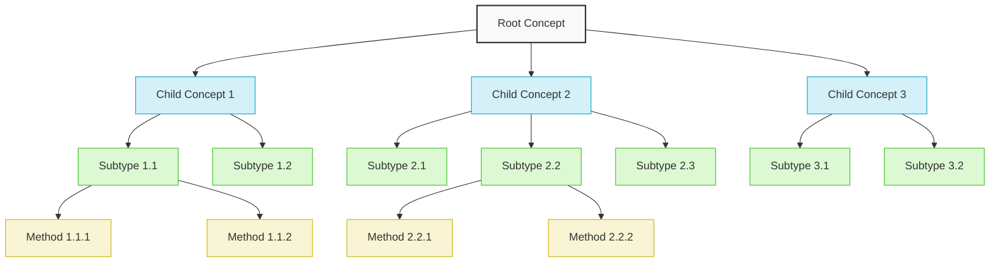
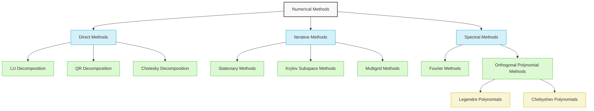
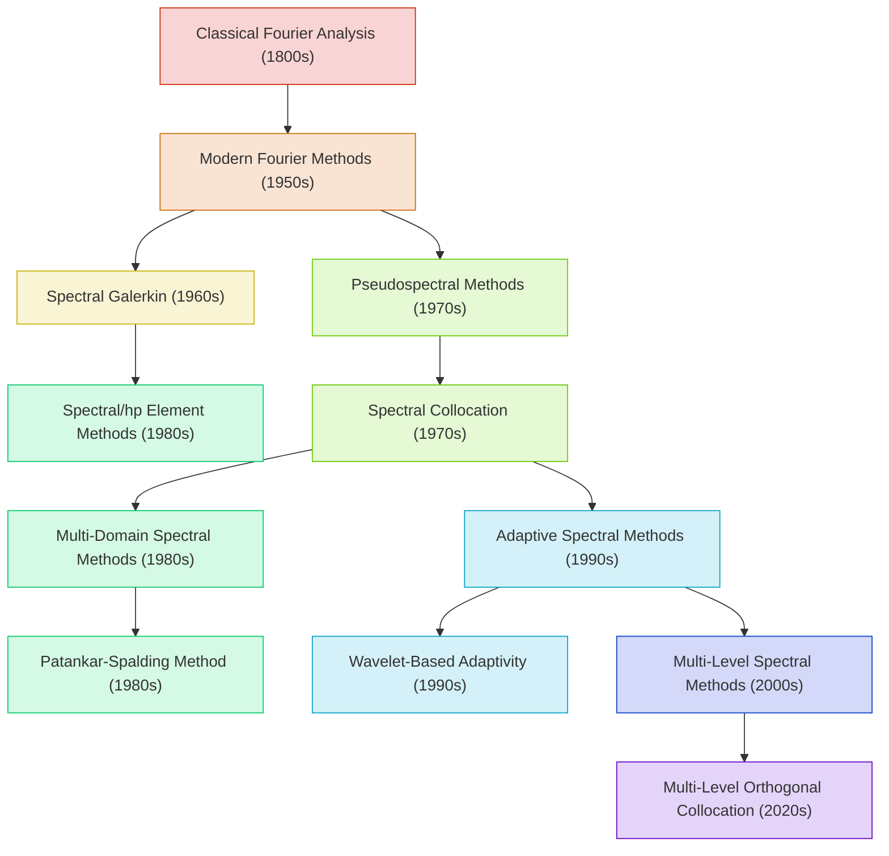
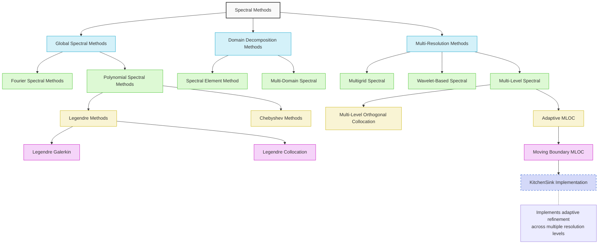

# Taxonomy Diagram Template

This template provides a standardized way to visualize hierarchical relationships between mathematical concepts, numerical methods, and algorithms. Taxonomy diagrams are essential for understanding the classification, derivation, and organization of related mathematical ideas.

## Basic Taxonomy Structure



## Taxonomy Types and Layouts

### Hierarchical Classification

For representing inheritance and specialization relationships:



### Feature-Based Classification

For organizing methods by their key characteristics:

```mermaid
graph TD
    %% Feature-Based Classification
    
    PDEMethods[PDE Solution Methods] --> SpatialFeature[Spatial Discretization]
    PDEMethods --> TimeFeature[Time Integration]
    PDEMethods --> ErrorFeature[Error Characteristics]
    
    SpatialFeature --> FiniteDifference[Finite Difference]
    SpatialFeature --> FiniteElement[Finite Element]
    SpatialFeature --> FiniteVolume[Finite Volume]
    SpatialFeature --> SpectralMethods[Spectral Methods]
    
    TimeFeature --> Explicit[Explicit Methods]
    TimeFeature --> Implicit[Implicit Methods]
    TimeFeature --> SemiImplicit[Semi-Implicit Methods]
    
    ErrorFeature --> AlgebraicConvergence[Algebraic Convergence]
    ErrorFeature --> SpectralConvergence[Spectral Convergence]
    ErrorFeature --> AdaptiveError[Adaptive Error Control]
    
    %% Second level details
    FiniteDifference --> CentralDifference[Central Difference]
    FiniteDifference --> UpwindSchemes[Upwind Schemes]
    
    FiniteElement --> ContinuousGalerkin[Continuous Galerkin]
    FiniteElement --> DiscontinuousGalerkin[Discontinuous Galerkin]
    
    SpectralMethods --> CollocationMethods[Collocation Methods]
    SpectralMethods --> SpectralGalerkin[Spectral Galerkin]
    
    %% Styling
    classDef root fill:#f9f9f9,stroke:#333,stroke-width:2px
    classDef feature fill:#f5d4f9,stroke:#c805bd
    classDef method fill:#d4f1f9,stroke:#05a0c8
    classDef submethod fill:#ddf9d4,stroke:#3dbd25
    
    class PDEMethods root
    class SpatialFeature,TimeFeature,ErrorFeature feature
    class FiniteDifference,FiniteElement,FiniteVolume,SpectralMethods,Explicit,Implicit,SemiImplicit,AlgebraicConvergence,SpectralConvergence,AdaptiveError method
    class CentralDifference,UpwindSchemes,ContinuousGalerkin,DiscontinuousGalerkin,CollocationMethods,SpectralGalerkin submethod
```



### Historical Development

For showing the evolution and development of methods over time:



## Cross-Method Comparison Layout

For comparing different methods and their relationships:

```mermaid
graph TB
    %% Cross-Method Comparison
    
    root[PDE Solution Methods] --> fd[Finite Difference]
    root --> fe[Finite Element]
    root --> sv[Spectral/hp Element]
    root --> sc[Spectral Collocation]
    
    %% Properties as second level nodes
    fd --> fdProps[Properties]
    fe --> feProps[Properties]
    sv --> svProps[Properties]
    sc --> scProps[Properties]
    
    %% Property details
    fdProps --> fdAcc[Accuracy: O(h²) to O(h⁴)]
    fdProps --> fdFlex[Flexibility: Medium]
    fdProps --> fdImpl[Implementation: Simple]
    
    feProps --> feAcc[Accuracy: O(h^p)]
    feProps --> feFlex[Flexibility: High]
    feProps --> feImpl[Implementation: Complex]
    
    svProps --> svAcc[Accuracy: Spectral within element]
    svProps --> svFlex[Flexibility: High]
    svProps --> svImpl[Implementation: Very Complex]
    
    scProps --> scAcc[Accuracy: Spectral O(e^-N)]
    scProps --> scFlex[Flexibility: Low]
    scProps --> scImpl[Implementation: Medium]
    
    %% Cross-connections showing relationships
    fd -.-> fe
    fe -.-> sv
    sv -.-> sc
    
    %% Styling
    classDef method fill:#d4f1f9,stroke:#05a0c8
    classDef props fill:#f5f5f5,stroke:#333
    classDef details fill:#ddf9d4,stroke:#3dbd25
    
    class root root
    class fd,fe,sv,sc method
    class fdProps,feProps,svProps,scProps props
    class fdAcc,fdFlex,fdImpl,feAcc,feFlex,feImpl,svAcc,svFlex,svImpl,scAcc,scFlex,scImpl details
```

## Example: Multi-Level Orthogonal Collocation Taxonomy



## Guidelines for Effective Taxonomy Visualization

1. **Clear Hierarchy**: Ensure the hierarchical structure is immediately apparent
2. **Appropriate Depth**: Limit the depth to 3-4 levels for readability
3. **Consistent Naming**: Use consistent naming conventions across the taxonomy
4. **Color Coding**: Use colors to distinguish different levels or categories
5. **Relationship Indications**: Use different line styles for different relationship types
6. **Balanced Structure**: Aim for a balanced tree structure where possible
7. **Annotations**: Add notes to explain key concepts or relationships
8. **References**: Include citations to relevant papers for terminology or classifications
9. **Cross-Links**: Show cross-category relationships where appropriate
10. **Focus Area**: Highlight the specific methods of interest in the taxonomy

## Usage in Knowledge Extraction

When creating taxonomy diagrams for mathematical concepts from papers:

1. Identify the hierarchical classification structure
2. Determine the appropriate taxonomy type (hierarchical, feature-based, historical)
3. Position the method of interest in the larger context
4. Use consistent terminology with the original paper
5. Add citations for specific classification decisions
6. Highlight relationships to other methods
7. Include notes explaining key differentiating features

## Example Usage

```
# Taxonomy: Multi-Level Orthogonal Collocation Methods

## Overview
- **Classification**: Hierarchical taxonomy of spectral methods
- **Source**: Smith and Johnson (2023), Section 1.2
- **Purpose**: Position Multi-Level Orthogonal Collocation within the broader context of numerical methods

## Taxonomy Diagram

[Insert Mermaid diagram here]

## Classification Details

1. **Spectral Methods**
   - Methods using global or high-order local basis functions
   - Characterized by high accuracy for smooth solutions
   - Paper reference: Section 1.1

2. **Multi-Resolution Methods**
   - Employ basis functions at different resolution levels
   - Allow adaptive refinement based on solution features
   - Paper reference: Section 1.3

3. **Multi-Level Orthogonal Collocation**
   - Combines orthogonal polynomial basis with multi-level structure
   - Features hierarchical error estimation between levels
   - Paper reference: Section 2.1-2.3

4. **Moving Boundary MLOC**
   - Extends MLOC with coordinate transformation for moving boundaries
   - Preserves spectral accuracy while handling dynamic domains
   - Paper reference: Section 4.1-4.3

## Relationship to Other Methods

- **Compared to Spectral Element Methods**: Both use high-order polynomials, but MLOC uses hierarchical levels instead of element decomposition (Section 5.1)
- **Compared to Multigrid Methods**: Similar hierarchical structure, but MLOC uses spectral basis functions instead of standard finite elements (Section 5.2)
- **Compared to Wavelet Methods**: Both offer multi-resolution capabilities, but MLOC provides stronger connection to classical spectral methods (Section 5.3)

## Notes on KitchenSink Implementation

The KitchenSink solver implements the Moving Boundary MLOC method with the following enhancements:
- Adaptive level management based on error estimates
- Flexible basis function selection (Legendre, Chebyshev)
- Optimized implementation for Julia and SciML ecosystem
```
