# Hierarchical Relationship Visualization Template

This template provides a standardized way to visualize hierarchical relationships between entities in the knowledge graph, focusing on parent-child relationships, inheritance hierarchies, and nested structures.

## Basic Hierarchical Structure

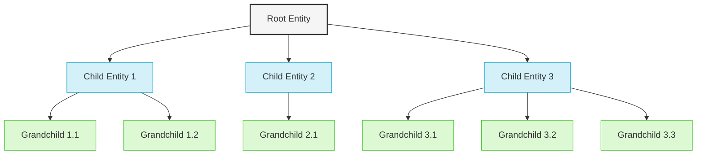

## Layout Options

### Top-Down Hierarchical Layout (Default)

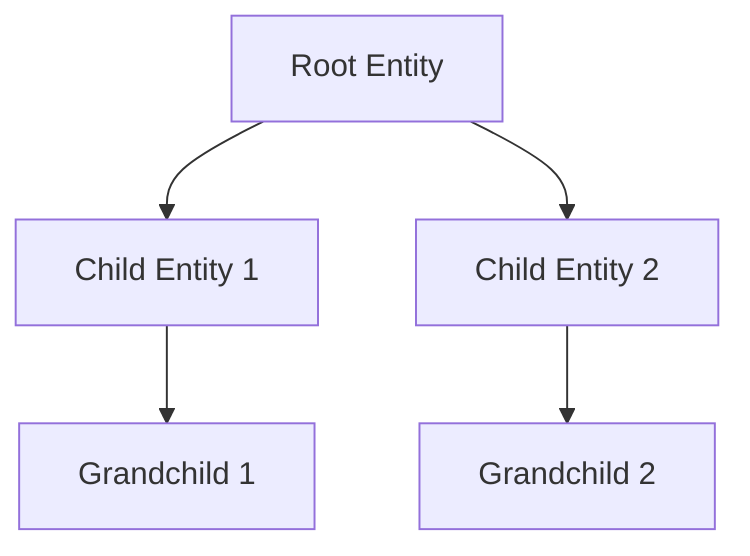

### Bottom-Up Hierarchical Layout

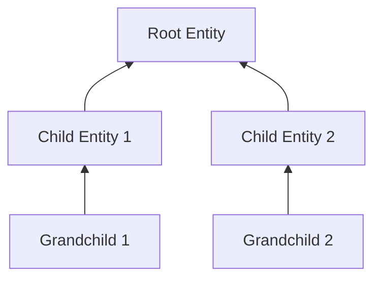

### Left-to-Right Hierarchical Layout

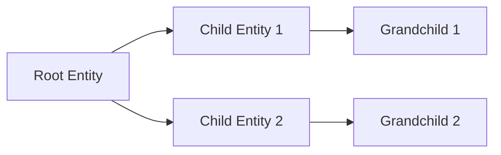

### Right-to-Left Hierarchical Layout

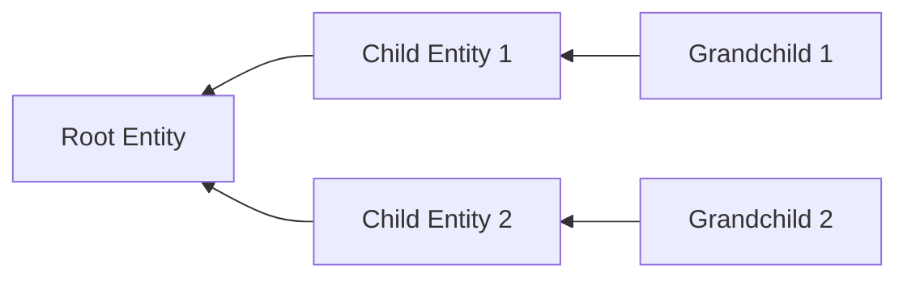

## Relationship Types and Styling

Different arrow styles can be used to represent different types of hierarchical relationships:

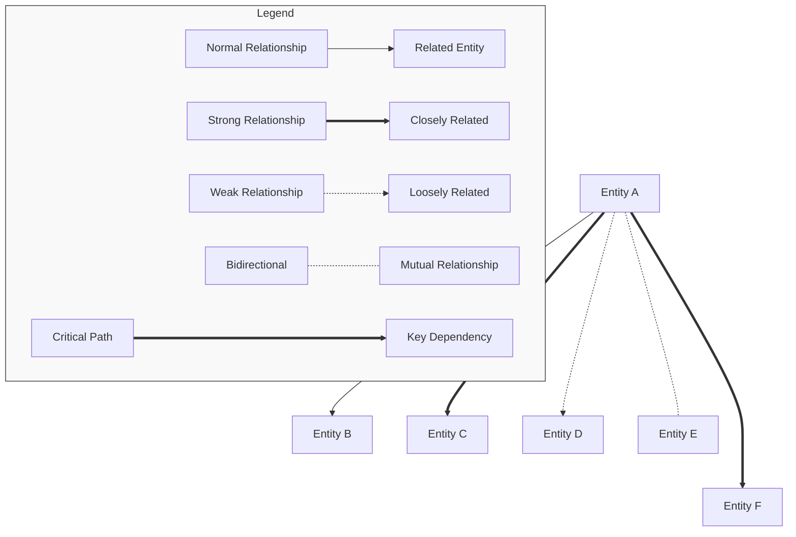

### Knowledge Graph Relationship Types

For the knowledge extraction system, use consistent styling for different relationship types:

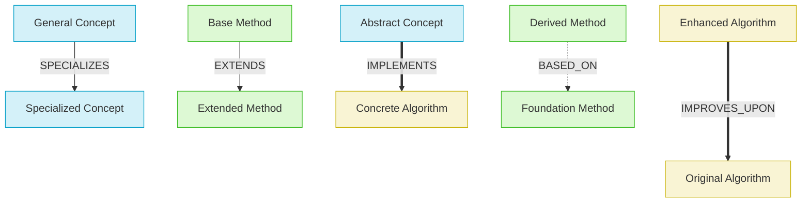

## Advanced Hierarchical Patterns

### Multi-Level Inheritance

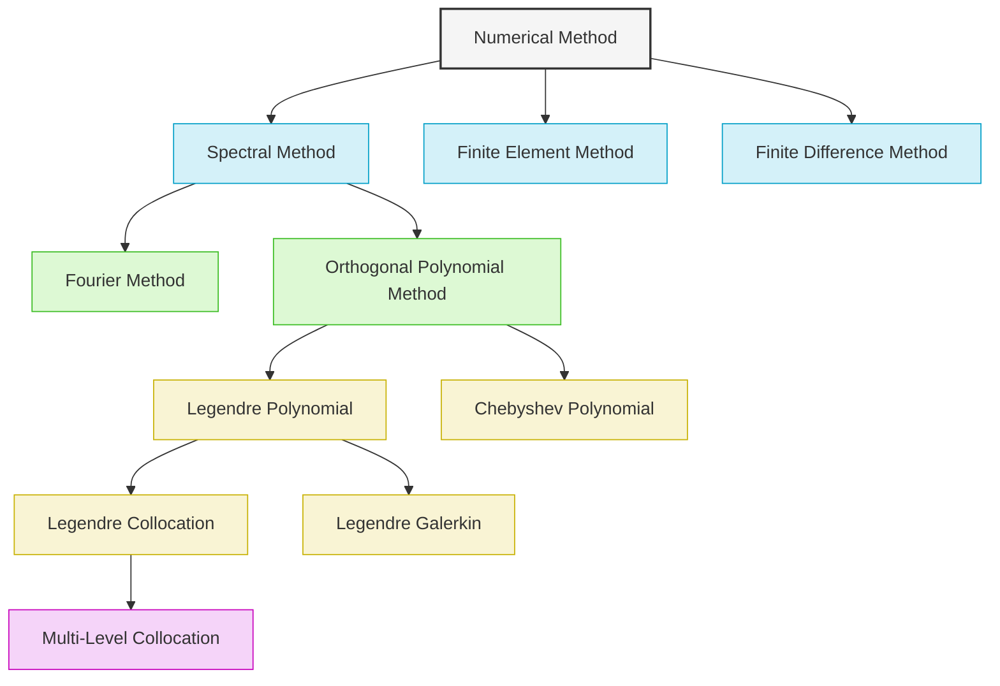

### Large Hierarchy with Collapsible Sections

For large hierarchies, use subgraphs to create collapsible sections:

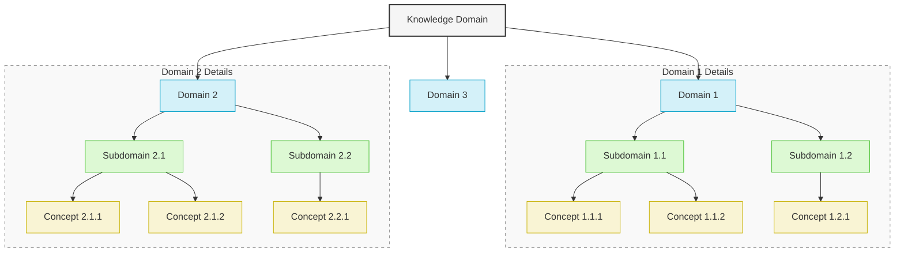

## Example: KitchenSink Solver Inheritance Hierarchy

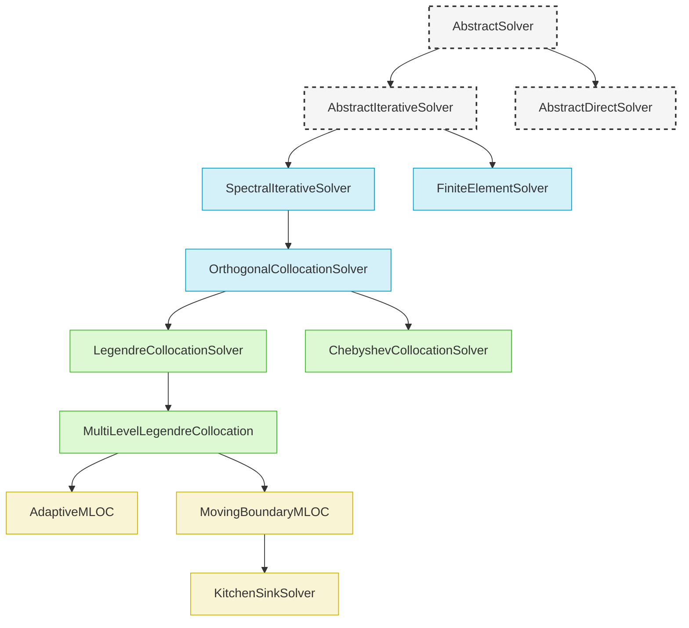

## Example: Pasteurization Modeling Entity Hierarchy

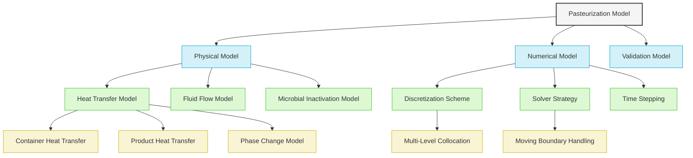

## Guidelines for Effective Hierarchical Relationship Visualization

1. **Appropriate Depth**: Limit hierarchy depth to 3-5 levels for readability
2. **Balanced Structure**: Aim for a balanced tree where possible
3. **Meaningful Node Names**: Use clear, descriptive entity names
4. **Consistent Relationship Types**: Use consistent arrow styles for the same relationship types
5. **Visual Hierarchy**: Use colors and styles to emphasize hierarchy levels
6. **Focused Scope**: Each diagram should focus on a specific aspect of the knowledge hierarchy
7. **Legends**: Include legends for complex hierarchies with multiple relationship types
8. **Layout Choice**: Select the most appropriate layout direction for your hierarchy
9. **Subgraphs**: Use subgraphs for logical grouping in large hierarchies
10. **Critical Path**: Highlight the most important relationships in the hierarchy

## Usage in Knowledge Extraction

When creating hierarchical relationship visualizations:

1. Identify the entities to be included in the hierarchy
2. Determine the primary relationship type (SPECIALIZES, EXTENDS, etc.)
3. Choose the appropriate hierarchy direction (TD, BT, LR, RL)
4. Design the visual hierarchy with appropriate styling
5. Add meaningful labels to explain relationship types
6. Include references to relevant concepts in the knowledge graph

## Knowledge Graph Integration Tips

- Use the same entity names in visualizations as in the knowledge graph
- Highlight relationships that correspond to Cypher relationship types
- Include entity types that match knowledge graph entity types
- Reference source papers or documents that establish these relationships
- Consider generating these visualizations automatically from the knowledge graph

## Example Usage

```
# Hierarchical Relationship: KitchenSink Solver Type Hierarchy

## Overview
- **Relationship Type**: Inheritance hierarchy (EXTENDS/SPECIALIZES)
- **Purpose**: Visualize the type system of the KitchenSink solver
- **Base Type**: AbstractSolver

## Hierarchical Visualization

[Insert Mermaid diagram here]

## Key Entities

1. **Abstract Base Types**
   - AbstractSolver: Base type for all solvers
   - AbstractIterativeSolver: Base type for iterative solution methods
   - SpectralIterativeSolver: Base type for spectral iterative methods

2. **Specialized Solvers**
   - OrthogonalCollocationSolver: Implementation of orthogonal collocation method
   - LegendreCollocationSolver: Specific implementation using Legendre polynomials
   - MultiLevelLegendreCollocation: Multi-level version with hierarchical basis

3. **Final Implementation**
   - MovingBoundaryMLOC: Adds moving boundary capabilities
   - KitchenSinkSolver: Complete implementation with all features

## Knowledge Graph Integration

This hierarchy directly corresponds to the following Cypher relationships:
- (AbstractSolver)<-[:EXTENDS]-(AbstractIterativeSolver)
- (AbstractIterativeSolver)<-[:EXTENDS]-(SpectralIterativeSolver)
- (SpectralIterativeSolver)<-[:EXTENDS]-(OrthogonalCollocationSolver)
- Etc.

## Implementation Notes

The inheritance hierarchy reflects Julia's type system and multiple dispatch pattern, with abstract types providing interfaces and concrete types implementing specific functionality.
```
