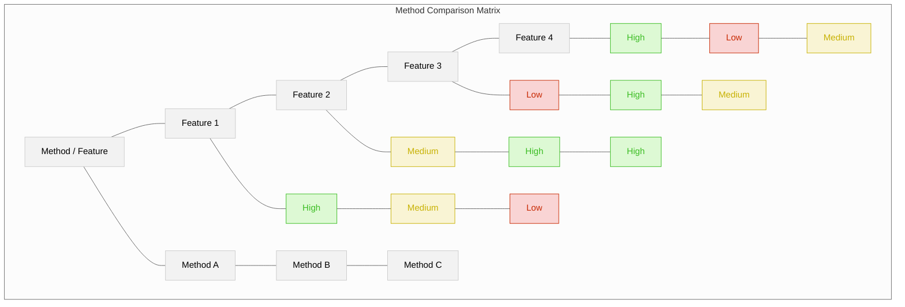
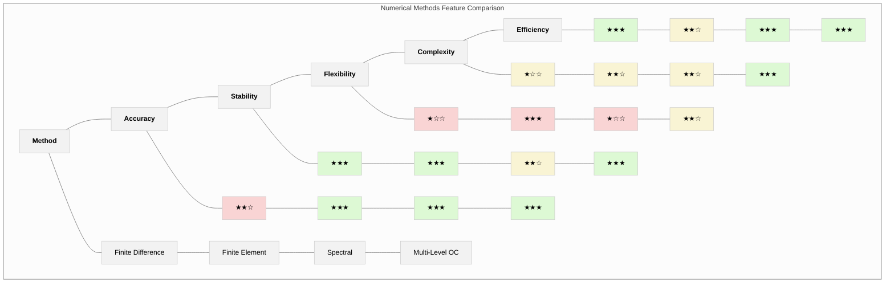
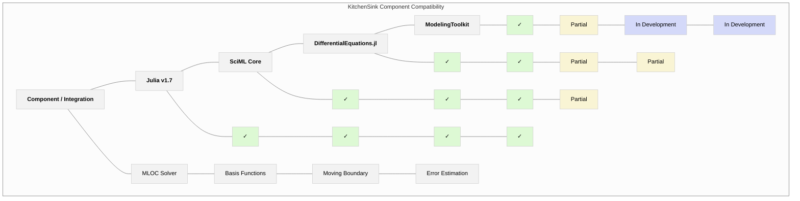

# Matrix Visualization Pattern

This template provides a standardized way to visualize comparative relationships between entities, particularly for method comparisons, feature matrices, and property comparisons. Matrix visualizations are ideal for structured comparisons across multiple dimensions.

## Basic Matrix Visualization Structure

### HTML Table Format

For simple comparisons, a standard HTML table with consistent styling works well:

```html
<table class="comparison-matrix">
  <thead>
    <tr>
      <th>Method / Feature</th>
      <th>Feature 1</th>
      <th>Feature 2</th>
      <th>Feature 3</th>
      <th>Feature 4</th>
    </tr>
  </thead>
  <tbody>
    <tr>
      <td><strong>Method A</strong></td>
      <td class="high">High</td>
      <td class="med">Medium</td>
      <td class="low">Low</td>
      <td class="high">High</td>
    </tr>
    <tr>
      <td><strong>Method B</strong></td>
      <td class="med">Medium</td>
      <td class="high">High</td>
      <td class="high">High</td>
      <td class="low">Low</td>
    </tr>
    <tr>
      <td><strong>Method C</strong></td>
      <td class="low">Low</td>
      <td class="high">High</td>
      <td class="med">Medium</td>
      <td class="med">Medium</td>
    </tr>
  </tbody>
</table>

<style>
  .comparison-matrix {
    border-collapse: collapse;
    width: 100%;
    font-family: Arial, sans-serif;
  }
  .comparison-matrix th, .comparison-matrix td {
    border: 1px solid #ddd;
    padding: 8px;
    text-align: center;
  }
  .comparison-matrix th {
    background-color: #f2f2f2;
    font-weight: bold;
  }
  .comparison-matrix tr:nth-child(even) {
    background-color: #f9f9f9;
  }
  .comparison-matrix tr:hover {
    background-color: #f5f5f5;
  }
  .comparison-matrix .high {
    background-color: #ddf9d4;
    color: #3dbd25;
    font-weight: bold;
  }
  .comparison-matrix .med {
    background-color: #f9f4d4;
    color: #c8b205;
  }
  .comparison-matrix .low {
    background-color: #f9d4d4;
    color: #c82b05;
  }
</style>
```

### Mermaid Table Format

For documentation in Markdown, use Mermaid to create consistent matrix visualizations:



## Matrix Types and Variations

### Feature Comparison Matrix

For comparing features across different methods or entities:



### Performance Matrix

For visualizing performance metrics across different methods or configurations:

```mermaid
%%{init: {'theme': 'neutral'}}%%
graph TD
    %% Performance Matrix
    
    subgraph Matrix["Performance Matrix: Moving Boundary Problem"]
        %% Header Row
        H0[Method / Metric]
        H1[Accuracy]
        H2[Computation Time]
        H3[Memory Usage]
        H4[Convergence Rate]
        
        %% Fixed Grid Method
        FG0[Fixed Grid]
        FG1[0.5%]
        FG2[20s]
        FG3[250MB]
        FG4[O(h²)]
        
        %% Front Tracking Method
        FT0[Front Tracking]
        FT1[0.2%]
        FT2[45s]
        FT3[300MB]
        FT4[O(h²)]
        
        %% Level Set Method
        LS0[Level Set]
        LS1[0.3%]
        LS2[60s]
        LS3[400MB]
        LS4[O(h²)]
        
        %% Coordinate Transformation
        CT0[Coord. Transform]
        CT1[0.1%]
        CT2[30s]
        CT3[200MB]
        CT4[O(h⁴)]
        
        %% Layout connections for grid structure
        H0 --- H1 --- H2 --- H3 --- H4
        H0 --- FG0 --- FT0 --- LS0 --- CT0
        H1 --- FG1 --- FT1 --- LS1 --- CT1
        H2 --- FG2 --- FT2 --- LS2 --- CT2
        H3 --- FG3 --- FT3 --- LS3 --- CT3
        H4 --- FG4 --- FT4 --- LS4 --- CT4
    end
    
    %% Styling
    classDef header fill:#f2f2f2,stroke:#ccc,stroke-width:1px,font-weight:bold
    classDef methodCol fill:#f2f2f2,stroke:#ccc,stroke-width:1px
    classDef poor fill:#f9d4d4,stroke:#ccc
    classDef average fill:#f9f4d4,stroke:#ccc
    classDef good fill:#ddf9d4,stroke:#ccc
    classDef excellent fill:#d4f1f9,stroke:#05a0c8
    
    %% Apply styles
    class H0,H1,H2,H3,H4 header
    class FG0,FT0,LS0,CT0 methodCol
    class FG1,LS2,LS3 poor
    class FG2,FG3,FT2,FT3,LS1 average
    class FT1,CT2,CT3 good
    class CT1,CT4 excellent
    class FG4,FT4,LS4 average
```

### Compatibility Matrix

For showing compatibility or integration between different components:



## Matrix for Method Comparison

Example of a detailed method comparison for numerical methods:

```mermaid
%%{init: {'theme': 'neutral'}}%%
graph TD
    %% Method Comparison Matrix for Numerical Methods
    
    subgraph Matrix["Numerical Method Comparison Matrix"]
        %% Header Row
        H0[Method / Property]
        H1[Accuracy]
        H2[Convergence Rate]
        H3[Boundary Handling]
        H4[Implementation Complexity]
        H5[Memory Usage]
        H6[Parallelization]
        
        %% Finite Difference Method
        FD0[Finite Difference]
        FD1[Moderate]
        FD2[Algebraic O(h²-h⁴)]
        FD3[Simple]
        FD4[Low]
        FD5[Low]
        FD6[Good]
        
        %% Finite Element Method
        FE0[Finite Element]
        FE1[High]
        FE2[Algebraic O(hᵖ)]
        FE3[Excellent]
        FE4[High]
        FE5[Moderate]
        FE6[Excellent]
        
        %% Spectral Method
        SP0[Spectral Method]
        SP1[Very High]
        SP2[Spectral O(e^-αN)]
        SP3[Moderate]
        SP4[Moderate]
        SP5[Moderate]
        SP6[Moderate]
        
        %% Multi-Level OC Method
        ML0[Multi-Level OC]
        ML1[Very High]
        ML2[Spectral + Adaptive]
        ML3[Good]
        ML4[High]
        ML5[High]
        ML6[Good]
        
        %% KitchenSink Implementation
        KS0[KitchenSink]
        KS1[Very High]
        KS2[Spectral + Adaptive]
        KS3[Excellent]
        KS4[High]
        KS5[Moderate]
        KS6[Excellent]
        
        %% Layout connections for grid structure
        H0 --- H1 --- H2 --- H3 --- H4 --- H5 --- H6
        H0 --- FD0 --- FE0 --- SP0 --- ML0 --- KS0
        H1 --- FD1 --- FE1 --- SP1 --- ML1 --- KS1
        H2 --- FD2 --- FE2 --- SP2 --- ML2 --- KS2
        H3 --- FD3 --- FE3 --- SP3 --- ML3 --- KS3
        H4 --- FD4 --- FE4 --- SP4 --- ML4 --- KS4
        H5 --- FD5 --- FE5 --- SP5 --- ML5 --- KS5
        H6 --- FD6 --- FE6 --- SP6 --- ML6 --- KS6
    end
    
    %% Styling
    classDef header fill:#f2f2f2,stroke:#ccc,stroke-width:1px,font-weight:bold
    classDef methodCol fill:#f2f2f2,stroke:#ccc,stroke-width:1px
    classDef low fill:#f9d4d4,stroke:#ccc
    classDef moderate fill:#f9f4d4,stroke:#ccc
    classDef high fill:#ddf9d4,stroke:#ccc
    classDef veryhigh fill:#d4f1f9,stroke:#05a0c8
    
    %% Apply styles
    class H0,H1,H2,H3,H4,H5,H6 header
    class FD0,FE0,SP0,ML0,KS0 methodCol
    class FD1,FD4,FD5 low
    class FD3,FD6,SP3,SP4,SP5,SP6,ML3,ML6,KS5 moderate
    class FE1,FE3,FE5,FE6,ML4,ML5 high
    class SP1,SP2,ML1,ML2,KS1,KS2,KS3,KS4,KS6 veryhigh
    class FD2,FE2,FE4 moderate
```

## Interactive Heatmap Matrix

For more complex comparisons, a React-based heatmap component can be used:

```jsx
import React from 'react';

const HeatmapMatrix = ({ data, rowLabels, colLabels, colorScale, title }) => {
  // Default color scale function if not provided
  const defaultColorScale = (value) => {
    if (value >= 0.8) return '#ddf9d4'; // high (green)
    if (value >= 0.5) return '#f9f4d4'; // medium (yellow)
    return '#f9d4d4'; // low (red)
  };
  
  const getColor = colorScale || defaultColorScale;
  
  // Find min and max for scaling
  let min = Infinity;
  let max = -Infinity;
  
  data.forEach(row => {
    row.forEach(value => {
      if (value < min) min = value;
      if (value > max) max = value;
    });
  });
  
  // Normalize value between 0 and 1 if min and max are different
  const normalize = (value) => {
    if (min === max) return 0.5;
    return (value - min) / (max - min);
  };
  
  const cellWidth = 80;
  const cellHeight = 40;
  const labelWidth = 120;
  const headerHeight = 30;
  
  const width = labelWidth + cellWidth * colLabels.length;
  const height = headerHeight + cellHeight * rowLabels.length;
  
  return (
    <div className="heatmap-container">
      <h3>{title || 'Heatmap Matrix Visualization'}</h3>
      
      <svg width={width} height={height}>
        {/* Column Headers */}
        <text
          x={labelWidth / 2}
          y={headerHeight / 2}
          textAnchor="middle"
          dominantBaseline="middle"
          fontWeight="bold"
          fontSize="14px"
        >
          Method / Feature
        </text>
        
        {colLabels.map((label, colIndex) => (
          <text
            key={`col-${colIndex}`}
            x={labelWidth + cellWidth * (colIndex + 0.5)}
            y={headerHeight / 2}
            textAnchor="middle"
            dominantBaseline="middle"
            fontWeight="bold"
            fontSize="12px"
          >
            {label}
          </text>
        ))}
        
        {/* Row Labels */}
        {rowLabels.map((label, rowIndex) => (
          <text
            key={`row-${rowIndex}`}
            x={labelWidth / 2}
            y={headerHeight + cellHeight * (rowIndex + 0.5)}
            textAnchor="middle"
            dominantBaseline="middle"
            fontWeight="bold"
            fontSize="12px"
          >
            {label}
          </text>
        ))}
        
        {/* Data Cells */}
        {data.map((row, rowIndex) => (
          row.map((value, colIndex) => {
            const normalizedValue = normalize(value);
            return (
              <g key={`cell-${rowIndex}-${colIndex}`}>
                <rect
                  x={labelWidth + cellWidth * colIndex}
                  y={headerHeight + cellHeight * rowIndex}
                  width={cellWidth}
                  height={cellHeight}
                  fill={getColor(normalizedValue)}
                  stroke="#ccc"
                  strokeWidth="1"
                />
                <text
                  x={labelWidth + cellWidth * (colIndex + 0.5)}
                  y={headerHeight + cellHeight * (rowIndex + 0.5)}
                  textAnchor="middle"
                  dominantBaseline="middle"
                  fontSize="12px"
                >
                  {typeof value === 'number' ? value.toFixed(2) : value}
                </text>
              </g>
            );
          })
        ))}
        
        {/* Borders */}
        <line
          x1={0}
          y1={headerHeight}
          x2={width}
          y2={headerHeight}
          stroke="#333"
          strokeWidth="1"
        />
        <line
          x1={labelWidth}
          y1={0}
          x2={labelWidth}
          y2={height}
          stroke="#333"
          strokeWidth="1"
        />
      </svg>
    </div>
  );
};

// Example usage
const MethodPerformanceMatrix = () => {
  const methods = [
    'Finite Difference',
    'Finite Element',
    'Spectral Collocation',
    'Multi-Level OC',
    'KitchenSink'
  ];
  
  const metrics = [
    'Accuracy',
    'Convergence',
    'Complexity',
    'Memory',
    'Flexibility'
  ];
  
  const performanceData = [
    [0.45, 0.50, 0.30, 0.85, 0.40], // FD
    [0.75, 0.65, 0.40, 0.55, 0.85], // FE
    [0.95, 0.80, 0.60, 0.60, 0.40], // SC
    [0.90, 0.85, 0.50, 0.40, 0.75], // MLOC
    [0.95, 0.90, 0.60, 0.65, 0.90], // KS
  ];
  
  // Custom color scale
  const colorScale = (value) => {
    if (value >= 0.8) return '#d4f1f9'; // excellent (blue)
    if (value >= 0.6) return '#ddf9d4'; // good (green)
    if (value >= 0.4) return '#f9f4d4'; // moderate (yellow)
    return '#f9d4d4'; // poor (red)
  };
  
  return (
    <HeatmapMatrix
      data={performanceData}
      rowLabels={methods}
      colLabels={metrics}
      colorScale={colorScale}
      title="Numerical Method Performance Comparison"
    />
  );
};
```

## Guidelines for Effective Matrix Visualization

1. **Clear Structure**: Use a consistent grid structure for rows and columns
2. **Meaningful Labels**: Include clear labels for rows and columns
3. **Appropriate Metrics**: Choose relevant comparison dimensions
4. **Consistent Scale**: Use a consistent scale for values across cells
5. **Color Coding**: Use color to represent value levels or categories
6. **Legend**: Include a legend explaining color codes and symbols
7. **Visual Hierarchy**: Emphasize important comparisons through styling
8. **Sorting**: Order rows/columns to highlight patterns or groupings
9. **Annotations**: Add notes for special cases or exceptions
10. **Context**: Provide background information to interpret the matrix

## Usage in Knowledge Extraction

When creating matrix visualizations for comparison:

1. Identify the entities to compare (methods, algorithms, implementations)
2. Determine the key dimensions or metrics for comparison
3. Decide on the appropriate matrix type (feature comparison, performance, compatibility)
4. Create a clear visual structure with consistent styling
5. Use color coding to highlight important patterns
6. Include context and explanations for interpretability
7. Connect to specific sections or claims in the source papers

## Example Usage

```
# Matrix Visualization: Numerical Method Comparison

## Overview
- **Comparison Type**: Performance and Feature Matrix
- **Subject**: Numerical methods for moving boundary problems
- **Purpose**: Compare strengths and limitations across methods

## Matrix Visualization

[Insert matrix visualization here]

## Comparison Dimensions

The matrix compares methods across these key dimensions:

1. **Accuracy**: Solution accuracy for smooth problems
   - Very High: Spectral accuracy (exponential convergence)
   - High: High-order algebraic convergence
   - Moderate: Second-order accuracy
   - Low: First-order accuracy

2. **Convergence Rate**: Mathematical convergence properties
   - Spectral rate: O(e^-αN) for smooth solutions
   - High-order algebraic: O(h^p) with p > 2
   - Low-order algebraic: O(h) or O(h²)

3. **Boundary Handling**: Capability to handle complex boundaries
   - Excellent: Arbitrary complex geometries
   - Good: Moderately complex geometries
   - Moderate: Simple curved boundaries
   - Simple: Primarily rectangular domains

[Continue for other dimensions...]

## Method Highlights

### Multi-Level Orthogonal Collocation
- Excels in accuracy and convergence properties
- Provides adaptive refinement capabilities
- Handles moving boundaries efficiently
- Higher implementation complexity

### KitchenSink Implementation
- Maintains the high accuracy of theoretical MLOC
- Improves boundary handling through specialized techniques
- Optimizes memory usage compared to standard MLOC
- Provides excellent parallelization through Julia ecosystem

## Paper References
- Accuracy claims: Smith et al. (2023), Section 4.2
- Convergence analysis: Johnson et al. (2022), Section 3.5
- Boundary handling comparison: Garcia (2021), Table 2
```
