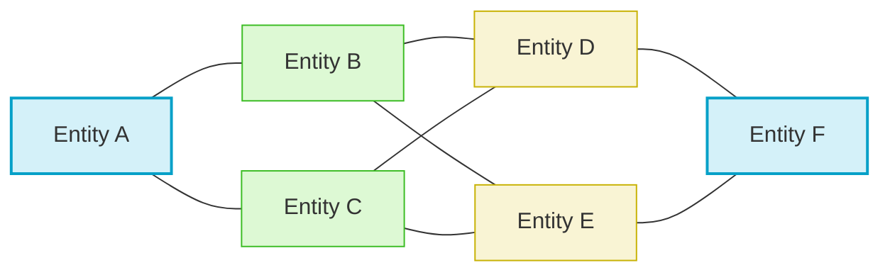
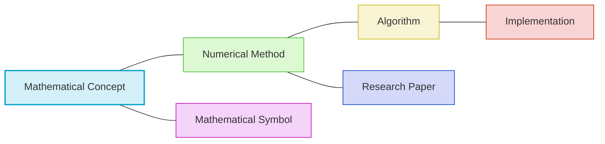
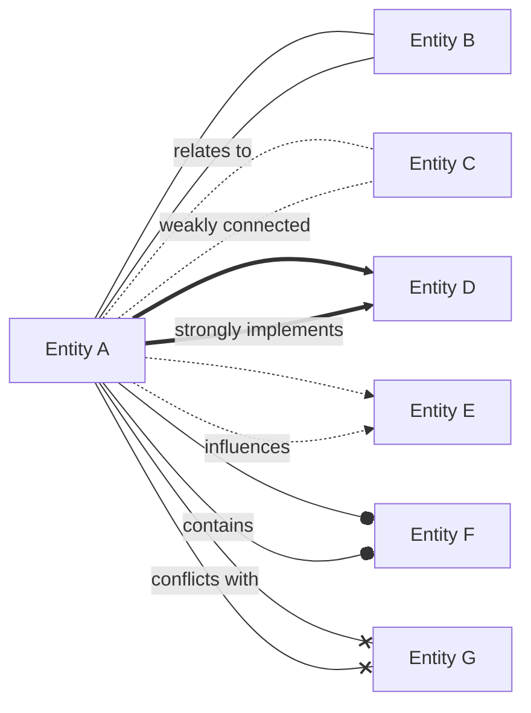
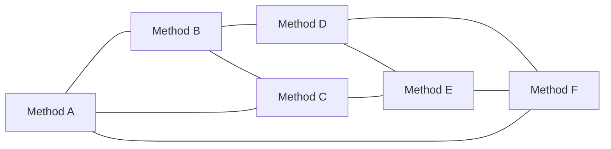
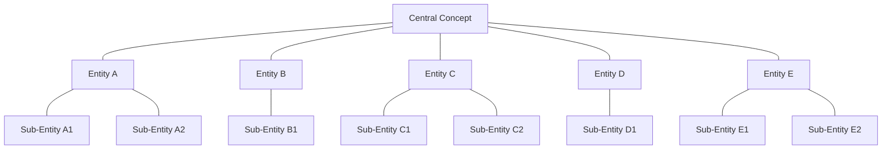
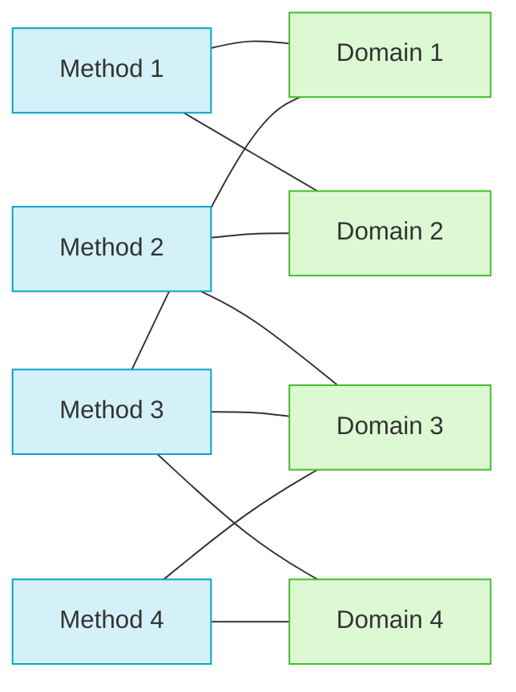
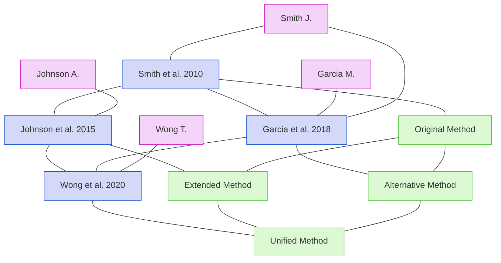
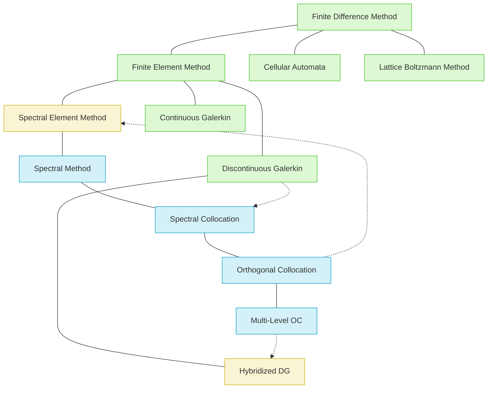
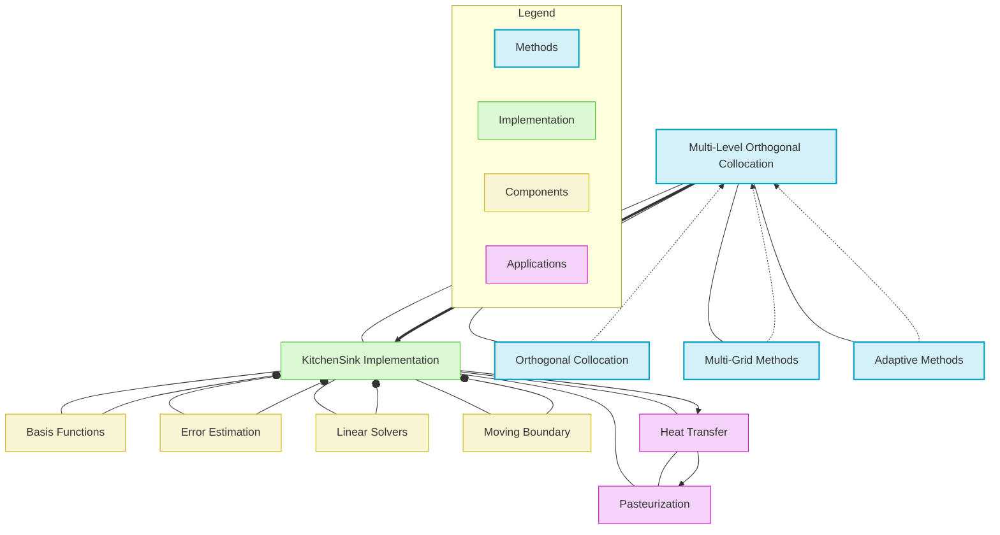

# Network Graph Visualization Pattern

This template provides a standardized way to visualize complex networks of relationships between entities in the knowledge graph, such as methods, concepts, symbols, and papers. Network graphs are particularly useful for showing interconnected structures and identifying central nodes or clusters.

## Basic Network Graph Structure



## Node and Edge Types

### Node Representations

Use consistent shapes and styles for different entity types:



### Edge Representations

Use different line styles to represent relationship types:



## Layout Patterns

### Force-Directed Layout

Best for general relationship networks with no specific hierarchy:



### Radial Layout

Emphasizes a central concept with related entities radiating outward:



### Bipartite Layout

Shows relationships between two distinct sets of entities:



## Citation Network Example

This example shows relationships between papers, authors, and methods:



## Method Relationship Network Example

This example visualizes relationships between numerical methods:



## KitchenSink Multi-Level Method Network

This example visualizes the KitchenSink solver's relationships with other methods and components:



## Interactive Network Visualization

For complex networks, consider using interactive visualization libraries like D3.js or Cytoscape.js through React components:

```jsx
import React, { useRef, useEffect } from 'react';
import * as d3 from 'd3';

const NetworkVisualization = ({ data }) => {
  const svgRef = useRef();
  
  useEffect(() => {
    if (!svgRef.current || !data) return;
    
    // Clear any existing visualization
    d3.select(svgRef.current).selectAll('*').remove();
    
    // Setup dimensions
    const width = 800;
    const height = 600;
    
    // Create SVG
    const svg = d3.select(svgRef.current)
      .attr('width', width)
      .attr('height', height)
      .append('g')
      .attr('transform', 'translate(40, 40)');
    
    // Create force simulation
    const simulation = d3.forceSimulation(data.nodes)
      .force('link', d3.forceLink(data.links).id(d => d.id).distance(100))
      .force('charge', d3.forceManyBody().strength(-300))
      .force('center', d3.forceCenter(width / 2, height / 2))
      .force('collision', d3.forceCollide().radius(50));
    
    // Create links
    const link = svg.append('g')
      .selectAll('line')
      .data(data.links)
      .enter()
      .append('line')
      .attr('stroke', d => d.color || '#999')
      .attr('stroke-width', d => d.value || 1)
      .attr('stroke-dasharray', d => d.dashed ? '5,5' : '0')
      .attr('marker-end', d => d.arrow ? 'url(#arrow)' : '');
    
    // Create arrow marker for directed links
    svg.append('defs').append('marker')
      .attr('id', 'arrow')
      .attr('viewBox', '0 -5 10 10')
      .attr('refX', 20)
      .attr('refY', 0)
      .attr('markerWidth', 6)
      .attr('markerHeight', 6)
      .attr('orient', 'auto')
      .append('path')
      .attr('d', 'M0,-5L10,0L0,5')
      .attr('fill', '#999');
    
    // Create nodes
    const node = svg.append('g')
      .selectAll('g')
      .data(data.nodes)
      .enter()
      .append('g')
      .call(d3.drag()
        .on('start', dragstarted)
        .on('drag', dragged)
        .on('end', dragended));
    
    // Add circles to nodes
    node.append('circle')
      .attr('r', d => d.size || 10)
      .attr('fill', d => d.color || '#69b3a2')
      .attr('stroke', '#fff')
      .attr('stroke-width', 1.5);
    
    // Add labels to nodes
    node.append('text')
      .attr('dx', 12)
      .attr('dy', '.35em')
      .text(d => d.name)
      .style('font-size', '12px')
      .style('font-family', 'Arial');
    
    // Add titles for tooltips
    node.append('title')
      .text(d => d.description || d.name);
    
    // Update positions on simulation tick
    simulation.on('tick', () => {
      link
        .attr('x1', d => d.source.x)
        .attr('y1', d => d.source.y)
        .attr('x2', d => d.target.x)
        .attr('y2', d => d.target.y);
      
      node.attr('transform', d => `translate(${d.x}, ${d.y})`);
    });
    
    // Drag functions
    function dragstarted(event, d) {
      if (!event.active) simulation.alphaTarget(0.3).restart();
      d.fx = d.x;
      d.fy = d.y;
    }
    
    function dragged(event, d) {
      d.fx = event.x;
      d.fy = event.y;
    }
    
    function dragended(event, d) {
      if (!event.active) simulation.alphaTarget(0);
      d.fx = null;
      d.fy = null;
    }
    
  }, [data]);
  
  return (
    <div className="network-visualization">
      <svg ref={svgRef}></svg>
    </div>
  );
};

// Example usage:
const MethodNetworkExample = () => {
  const networkData = {
    nodes: [
      { id: "MLOC", name: "Multi-Level OC", size: 15, color: "#d4f1f9", group: "method", 
        description: "Multi-Level Orthogonal Collocation method" },
      { id: "KS", name: "KitchenSink", size: 20, color: "#ddf9d4", group: "implementation",
        description: "KitchenSink solver implementation" },
      { id: "OC", name: "Orthogonal Collocation", size: 12, color: "#d4f1f9", group: "method",
        description: "Traditional Orthogonal Collocation method" },
      { id: "MG", name: "Multi-Grid", size: 12, color: "#d4f1f9", group: "method",
        description: "Multi-Grid numerical methods" },
      // Additional nodes...
    ],
    links: [
      { source: "MLOC", target: "KS", value: 3, arrow: true },
      { source: "OC", target: "MLOC", value: 2, dashed: true },
      { source: "MG", target: "MLOC", value: 2, dashed: true },
      // Additional links...
    ]
  };
  
  return <NetworkVisualization data={networkData} />;
};
```

## Guidelines for Effective Network Visualization

1. **Clear Node Distinction**: Use consistent colors and shapes for different entity types
2. **Meaningful Edge Styles**: Use edge styles (solid, dashed, arrows) to represent relationship types
3. **Appropriate Layout**: Choose the right layout for the network structure (force-directed, radial, bipartite)
4. **Visual Hierarchy**: Use size, color, and styling to emphasize important nodes and relationships
5. **Grouping**: Use subgraphs or clusters to organize related nodes
6. **Labeling**: Add clear labels for nodes and relationships
7. **Legend**: Include a legend explaining node types and relationship meanings
8. **Interactive Elements**: For complex networks, include zoom, pan, and selection features
9. **Filtering**: Allow hiding/showing different node or edge types for complex networks
10. **Focus Areas**: Highlight specific areas of interest in larger networks

## Usage in Knowledge Extraction

When creating network visualizations for knowledge graphs:

1. Decide on the focus entities and relationship types to visualize
2. Determine the appropriate network structure (full network, ego network, bipartite)
3. Choose a layout that best represents the relationship structure
4. Use consistent styling for node and edge types
5. Add clear labels and legends
6. Consider using subgraphs for logical grouping
7. For complex networks, create interactive visualizations with filtering

## Example Usage

```
# Network Visualization: Method Relationship Network

## Overview
- **Network Type**: Method Relationship Network
- **Focus**: KitchenSink solver in context of numerical methods
- **Purpose**: Visualize relationships between methods and implementations

## Network Visualization

[Insert Mermaid diagram or interactive visualization here]

## Network Structure

The network visualizes these key components:
1. **Methods and Algorithms**: Numerical methods related to KitchenSink
2. **Implementation Components**: Key components of the KitchenSink solver
3. **Applications**: Heat transfer and pasteurization applications
4. **Relationships**: Method inheritance, implementation, and application pathways

## Key Relationships

### Method Relationships
- Multi-Level Orthogonal Collocation derives from Orthogonal Collocation
- Multi-Level approach influenced by Multi-Grid methods
- Adaptive Methods contribute to the Multi-Level formulation

### Implementation Structure
- KitchenSink implements the Multi-Level Orthogonal Collocation method
- Key components include Basis Functions, Error Estimation, and Moving Boundary handling
- Integration with Julia SciML ecosystem provides solver capabilities

### Application Pathways
- Heat Transfer applications are the primary use case
- Pasteurization modeling builds on heat transfer capabilities
- Moving boundary handling enables phase change simulations

## Notes
This network visualization helps position the KitchenSink solver in the broader numerical methods landscape while showing its component structure and application domains.
```
