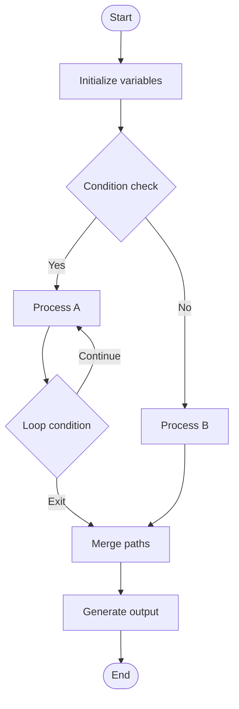
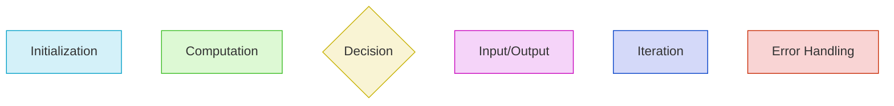
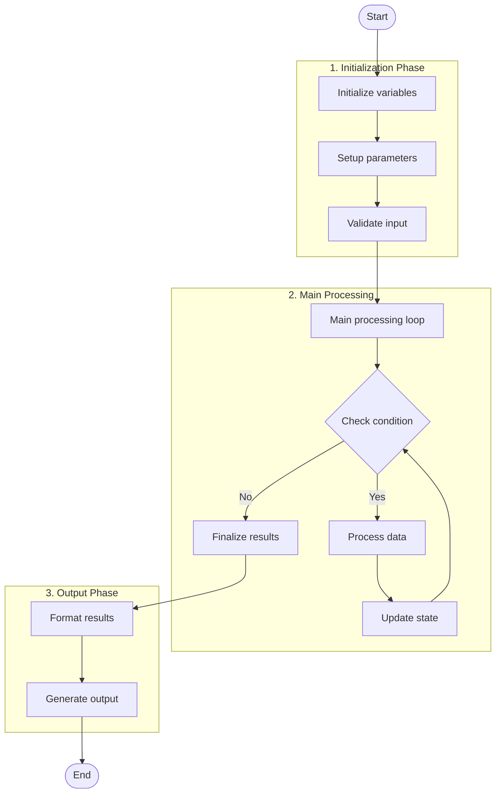

# Algorithm Flowchart Template

This template provides a standardized way to visualize algorithms as flowcharts using Mermaid diagrams.

## Basic Flowchart Structure



## Node Types and Styles

Use consistent shapes for specific algorithm components:

- **Start/End**: Rounded rectangles with double borders (`([Text])`)
- **Process/Action**: Rectangle (`[Text]`)
- **Decision/Condition**: Diamond (`{Text}`)
- **Input/Output**: Parallelogram (`[/Text/]` or `[\Text\]`)
- **Subroutine/Function**: Rectangle with vertical lines (`[[Text]]`)
- **Loop**: Use a diamond for the condition, with a backward arrow
- **Notes/Annotations**: Use dashed arrows (`-.->`) to connect annotations

## Color Scheme

Apply consistent colors to indicate different aspects of the algorithm:



Use the following style definitions:

```
%% Standard styles
style Initialization fill:#d4f1f9,stroke:#05a0c8
style Computation fill:#ddf9d4,stroke:#3dbd25
style Decision fill:#f9f4d4,stroke:#c8b205
style InputOutput fill:#f5d4f9,stroke:#c805bd
style Iteration fill:#d4d9f9,stroke:#0542c8
style ErrorHandling fill:#f9d4d4,stroke:#c82b05
```

## Subgraphs for Algorithm Sections

For complex algorithms, use subgraphs to organize sections:



## Example: Multi-Level Collocation Algorithm

```mermaid
flowchart TD
    %% Algorithm: Multi-Level Adaptive Spectral Collocation
    %% Based on: Smith and Johnson (2023)
    
    Start([Start]) --> Init[Initialize multi-level basis]
    
    %% Initialization
    subgraph Initialization["1. Initial Setup"]
        Init --> CreateLevels[Create M resolution levels]
        CreateLevels --> GeneratePoints[Generate collocation points]
        GeneratePoints --> ConstructBasis[Construct basis functions]
        ConstructBasis --> ApplyInitial[Apply initial conditions]
    end
    
    %% Time integration
    ApplyInitial --> TimeLoop[Begin time integration]
    
    subgraph TimeIntegration["2. Time Integration"]
        TimeLoop --> Boundary[Compute boundary values]
        Boundary --> Transform[Apply coordinate transformation]
        Transform --> FormulateSystem[Formulate multi-level system]
        
        subgraph SolutionProcess["2.1 Multi-Level Solution"]
            FormulateSystem --> SolveBase[Solve base level system]
            SolveBase --> ErrorCheck{Error > tolerance?}
            ErrorCheck -->|Yes| SolveRefined[Solve refined level]
            SolveRefined --> UpdateSolution[Update composite solution]
            UpdateSolution --> NextLevel{More levels?}
            NextLevel -->|Yes| ErrorCheck
            NextLevel -->|No| SolutionComplete[Solution complete]
            ErrorCheck -->|No| SkipLevel[Skip refinement level]
            SkipLevel --> NextLevel
        end
        
        SolutionComplete --> UpdateBoundary[Update moving boundary]
        UpdateBoundary --> AdaptCheck{Adaptation needed?}
        AdaptCheck -->|Yes| AdaptLevels[Add/remove levels]
        AdaptCheck -->|No| SkipAdapt[Skip adaptation]
        AdaptLevels --> TimeComplete
        SkipAdapt --> TimeComplete
        TimeComplete{Time complete?}
        TimeComplete -->|No| TimeLoop
        TimeComplete -->|Yes| FinalTransform[Transform to physical coordinates]
    end
    
    FinalTransform --> End([End])
    
    %% Apply styles
    style Init fill:#d4f1f9,stroke:#05a0c8
    style CreateLevels fill:#d4f1f9,stroke:#05a0c8
    style GeneratePoints fill:#d4f1f9,stroke:#05a0c8
    style ConstructBasis fill:#d4f1f9,stroke:#05a0c8
    style ApplyInitial fill:#d4f1f9,stroke:#05a0c8
    
    style TimeLoop fill:#d4d9f9,stroke:#0542c8
    style Boundary fill:#ddf9d4,stroke:#3dbd25
    style Transform fill:#ddf9d4,stroke:#3dbd25
    style FormulateSystem fill:#ddf9d4,stroke:#3dbd25
    
    style SolveBase fill:#ddf9d4,stroke:#3dbd25
    style SolveRefined fill:#ddf9d4,stroke:#3dbd25
    style UpdateSolution fill:#ddf9d4,stroke:#3dbd25
    
    style ErrorCheck fill:#f9f4d4,stroke:#c8b205
    style NextLevel fill:#f9f4d4,stroke:#c8b205
    style AdaptCheck fill:#f9f4d4,stroke:#c8b205
    style TimeComplete fill:#f9f4d4,stroke:#c8b205
    
    style UpdateBoundary fill:#ddf9d4,stroke:#3dbd25
    style AdaptLevels fill:#ddf9d4,stroke:#3dbd25
    style FinalTransform fill:#ddf9d4,stroke:#3dbd25
    
    style SolutionComplete fill:#d4f1f9,stroke:#05a0c8
    style SkipLevel fill:#d4d9f9,stroke:#0542c8
    style SkipAdapt fill:#d4d9f9,stroke:#0542c8
```



## Guidelines for Effective Algorithm Visualization

1. **Hierarchical Structure**: Arrange the flowchart from top to bottom, with clear progression.
2. **Consistent Naming**: Use consistent and descriptive names for nodes.
3. **Appropriate Granularity**: Include enough detail to understand the algorithm but avoid excessive granularity.
4. **Clear Decision Points**: Explicitly show all decision points with outcomes labeled.
5. **Loop Structure**: Clearly represent iterative processes with backward arrows.
6. **Annotations**: Add explanatory notes for complex steps.
7. **Subgraphs**: Use subgraphs to organize related steps for complex algorithms.
8. **Color Coding**: Use consistent colors to distinguish between different types of operations.

## Usage in Knowledge Extraction

When visualizing an algorithm from a paper:

1. Start with the high-level structure to capture the main phases
2. Add decision points and branches
3. Incorporate loops and iterative processes
4. Add explanatory notes for complex steps
5. Use color coding to highlight different algorithm components
6. Include reference to the original paper

## Example Usage

```
# Algorithm Visualization: Multi-Level Spectral Collocation

## Algorithm Overview
- **Name**: Multi-Level Adaptive Spectral Collocation for Moving Boundaries
- **Source**: Smith and Johnson (2023)
- **Purpose**: Solving PDEs with moving boundaries using adaptive multi-level collocation

## Flowchart Visualization

[Insert Mermaid diagram here]

## Key Components

1. **Initialization Phase**
   - Multi-level basis construction
   - Collocation point generation
   - Initial condition application

2. **Time Integration**
   - Coordinate transformation for moving boundary
   - Level-by-level solution process
   - Adaptive refinement based on error estimation

3. **Output Phase**
   - Transformation back to physical coordinates
   - Final solution composition

## Implementation Notes

[Add any implementation-specific details here]
```
