# Component Diagram Template

This template provides a standardized way to visualize the system architecture and component relationships of numerical algorithms, particularly for software implementations like KitchenSink. These diagrams use Mermaid's class and flowchart diagrams to represent components and their interactions.

## Basic Component Structure


## Component Relationship Types

Use these relationship types consistently:

- **Inheritance**: `<|--` (Component A inherits from Component B)
- **Composition**: `*--` (Component A contains Component B as an essential part)
- **Aggregation**: `o--` (Component A contains Component B but B can exist independently)
- **Association**: `--` (Component A is related to Component B)
- **Dependency**: `-->` (Component A depends on Component B)
- **Realization/Implementation**: `..|>` (Component A implements interface B)
- **Usage/Call**: `..>` (Component A uses/calls Component B)

## Component Types and Styles

For Julia/SciML implementations, use consistent component types:


## Layout Patterns

### Hierarchical Layout


### Module-Based Layout


### Layered Architecture


## Alternative: Flowchart for Component Interaction

For dynamic component interactions, a flowchart may be more appropriate:


## Example: Multi-Level Collocation Solver Architecture

```mermaid
classDiagram
    %% Component Diagram: Multi-Level Collocation Solver Architecture
    %% Based on: KitchenSink Implementation
    
    %% Abstract base types
    class AbstractDiscretization {
        <<abstract>>
        +discretize(problem)
        +create_operators()
    }
    
    class AbstractCollocationMethod {
        <<abstract>>
        +collocation_points()
        +basis_functions()
    }
    
    class AbstractMultiLevelMethod {
        <<abstract>>
        +num_levels()
        +error_estimation()
        +refinement_strategy()
    }
    
    %% Concrete implementations
    class MultiLevelCollocation {
        -levels
        -basis_type
        -max_degree
        -error_tol
        +collocation_points()
        +basis_functions()
        +level_error_estimate()
        +adapt_levels()
    }
    
    class LegendreCollocation {
        +generate_points()
        +construct_basis()
        +derivative_matrix()
    }
    
    class ChebyshevCollocation {
        +generate_points()
        +construct_basis()
        +derivative_matrix()
    }
    
    %% Support components
    class BasisFunctions {
        <<module>>
        +evaluate_basis()
        +basis_derivative()
    }
    
    class ErrorEstimator {
        +compute_error()
        +error_indicators()
        +mark_regions()
    }
    
    class MovingBoundaryHandler {
        +transform_coordinates()
        +compute_boundary_velocity()
        +update_boundary_position()
    }
    
    class AdaptiveStrategy {
        +refine_level()
        +coarsen_level()
        +optimal_distribution()
    }
    
    %% Integration components
    class TimeIntegrator {
        <<abstract>>
        +step()
        +adapt_step_size()
    }
    
    class ImplicitEuler {
        +step()
    }
    
    class RungeKutta {
        +step()
    }
    
    %% Domain components
    class ProblemDomain {
        +boundaries
        +dimensionality
        +transform_domain()
    }
    
    %% Inheritance relationships
    AbstractDiscretization <|-- AbstractCollocationMethod
    AbstractCollocationMethod <|-- LegendreCollocation
    AbstractCollocationMethod <|-- ChebyshevCollocation
    AbstractCollocationMethod <|-- AbstractMultiLevelMethod
    AbstractMultiLevelMethod <|-- MultiLevelCollocation
    TimeIntegrator <|-- ImplicitEuler
    TimeIntegrator <|-- RungeKutta
    
    %% Usage relationships
    MultiLevelCollocation --> BasisFunctions : uses
    MultiLevelCollocation --> ErrorEstimator : uses
    MultiLevelCollocation --> AdaptiveStrategy : uses
    MultiLevelCollocation --> ProblemDomain : uses
    MultiLevelCollocation --> MovingBoundaryHandler : uses for moving boundaries
    MultiLevelCollocation ..> TimeIntegrator : calls
    
    %% Module grouping
    class Discretization {
        <<module>>
    }
    
    class Solvers {
        <<module>>
    }
    
    class Utilities {
        <<module>>
    }
    
    Discretization -- AbstractDiscretization
    Discretization -- AbstractCollocationMethod
    Discretization -- AbstractMultiLevelMethod
    Discretization -- MultiLevelCollocation
    Discretization -- LegendreCollocation
    Discretization -- ChebyshevCollocation
    
    Solvers -- TimeIntegrator
    Solvers -- ImplicitEuler
    Solvers -- RungeKutta
    
    Utilities -- BasisFunctions
    Utilities -- ErrorEstimator
    Utilities -- AdaptiveStrategy
    Utilities -- MovingBoundaryHandler
    Utilities -- ProblemDomain
```



## Guidelines for Effective Component Visualization

1. **Clear Component Names**: Use descriptive, self-explanatory names for components
2. **Appropriate Abstraction**: Show the right level of detail (not too much, not too little)
3. **Consistent Relationships**: Use relationship arrows consistently
4. **Logical Grouping**: Group related components using modules or subgraphs
5. **Hierarchical Structure**: Show inheritance and composition hierarchies clearly
6. **Interface Emphasis**: Highlight key interfaces between components
7. **Type Annotations**: Add type annotations for complex relationships
8. **Focused Scope**: Each diagram should have a clear focus and purpose

## Usage in Knowledge Extraction

When creating component diagrams for numerical methods and algorithms:

1. Identify the main components of the system or algorithm
2. Determine the relationships and dependencies between components
3. Organize components into a logical hierarchy or structure
4. Use appropriate relationship types to show interactions
5. Add key methods and properties to components
6. Group related components using modules or subgraphs
7. Include references to corresponding sections in the paper

## Example Usage

```
# Component Architecture: Multi-Level Collocation Solver

## Overview
- **System**: KitchenSink Multi-Level Collocation Solver
- **Based on**: Smith and Johnson (2023)
- **Purpose**: Provide a modular implementation of multi-level adaptive spectral collocation

## Architecture Diagram

[Insert Mermaid diagram here]

## Key Components

1. **Discretization Hierarchy**
   - AbstractDiscretization: Base type for all discretization methods
   - AbstractCollocationMethod: Base type for collocation approaches
   - AbstractMultiLevelMethod: Base type for multi-level capabilities
   - MultiLevelCollocation: Concrete implementation of multi-level collocation

2. **Support Components**
   - BasisFunctions: Provides orthogonal polynomial basis functions
   - ErrorEstimator: Computes error estimates between levels
   - AdaptiveStrategy: Implements refinement strategies
   - MovingBoundaryHandler: Manages coordinate transformations

3. **Integration Components**
   - TimeIntegrator: Abstract interface for time stepping methods
   - ImplicitEuler / RungeKutta: Concrete time integrators

## Implementation Notes

The architecture follows Julia's multiple dispatch pattern with abstract type hierarchies. The components are designed to be modular, allowing for:

- Different basis function types (Legendre, Chebyshev)
- Various time integration strategies
- Flexible error estimation and adaptation
- Optional moving boundary handling

Components communicate through well-defined interfaces, enabling easy extension and modification for specific problem requirements.

## Paper References
- Core algorithm components: Section 2.1-2.3
- Multi-level structure: Section 3.1
- Error estimation: Section 3.4
- Moving boundary handling: Section 4.2
```
