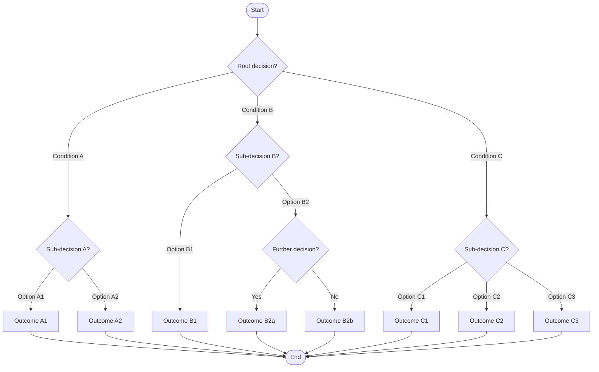
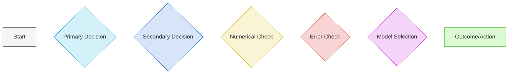
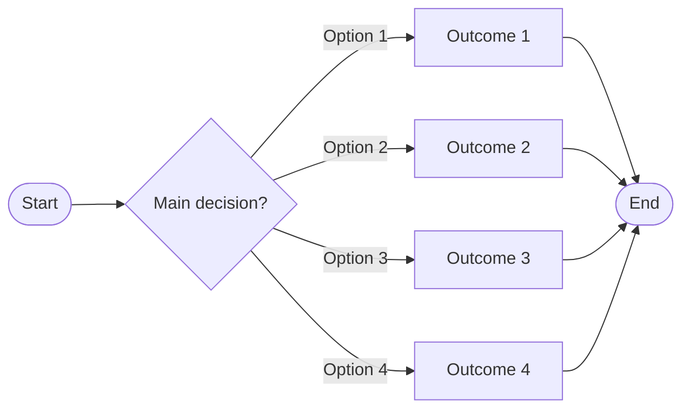
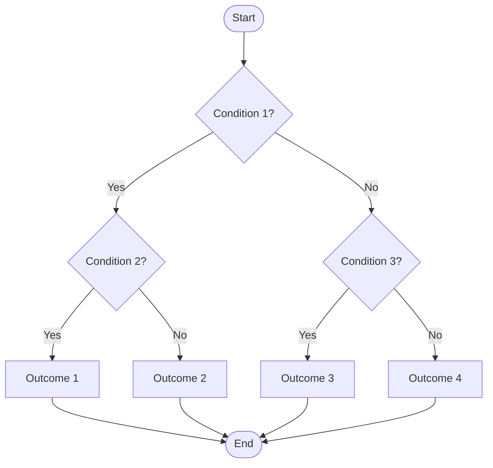
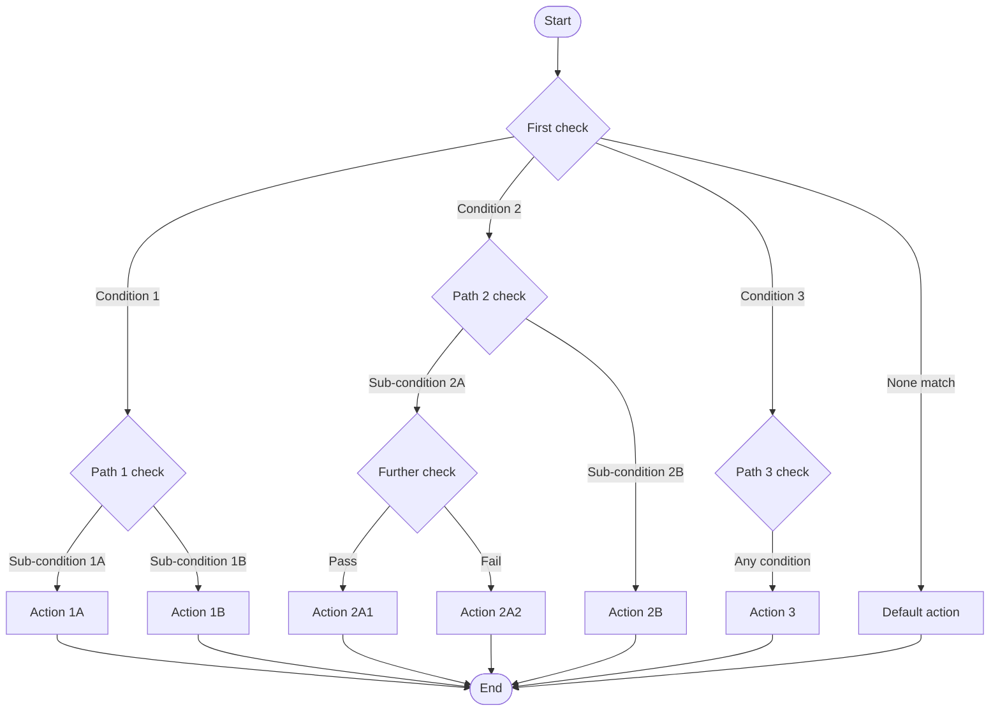
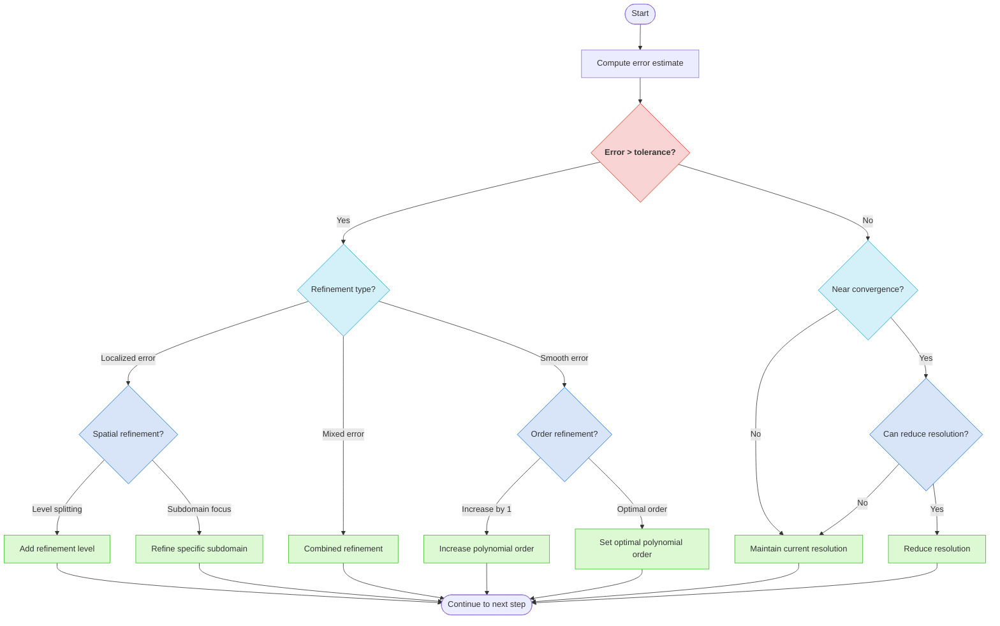

# Decision Tree Template

This template provides a standardized way to visualize algorithm decision processes using Mermaid diagrams, particularly useful for displaying adaptive procedures, error handling, and algorithm selection logic.

## Basic Decision Tree Structure



## Node Types and Styles

Use consistent shapes for specific components:

- **Start/End**: Rounded rectangles with double borders (`([Text])`)
- **Decision Nodes**: Diamond (`{Question?}`)
- **Outcomes/Actions**: Rectangle (`[Text]`)
- **Notes/Annotations**: Use dashed arrows (`-.->`) to connect annotations

## Color Scheme

Apply consistent colors to indicate different types of decisions:



Use the following style definitions:

```
%% Decision tree styles
style PrimaryDecision fill:#d4f1f9,stroke:#05a0c8
style SecondaryDecision fill:#d8e5f9,stroke:#0566c8
style NumericalCheck fill:#f9f4d4,stroke:#c8b205
style ErrorCheck fill:#f9d4d4,stroke:#c82b05
style ModelSelection fill:#f5d4f9,stroke:#c805bd
style Outcome fill:#ddf9d4,stroke:#3dbd25
```

## Decision Tree Layouts

Depending on the complexity and structure of decisions, consider these layout options:

### Horizontal Layout (for fewer levels with many options)



### Binary Tree Layout (for yes/no decisions)



### Multi-Path Layout (for complex decision trees)



## Example: Error Estimation and Adaptive Refinement Decision Tree



## Guidelines for Effective Decision Tree Visualization

1. **Clear Decision Criteria**: Ensure each decision node has clear, unambiguous criteria
2. **Complete Coverage**: All possible conditions should be covered by branches
3. **Consistent Terminology**: Use consistent wording for similar concepts
4. **Logical Flow**: Arrange the tree to follow the natural flow of decision making
5. **Descriptive Branch Labels**: Label each branch with specific conditions
6. **Manageable Size**: Break very large trees into logical sub-trees if needed
7. **Outcome Clarity**: Make terminal nodes (outcomes) clearly distinguishable
8. **Proper Hierarchy**: More general decisions should precede specific ones

## Usage in Knowledge Extraction

When creating a decision tree from algorithmic descriptions in papers:

1. Identify key decision points in the algorithm
2. Determine the criteria used at each decision point
3. Map out all possible outcomes from each decision
4. Arrange decisions in hierarchical order
5. Use consistent formatting and color coding
6. Include references to corresponding sections in the paper

## Example Usage

```
# Decision Tree: Adaptive Refinement Strategy

## Overview
- **Process**: Error estimation and adaptive refinement strategy
- **Source**: Smith and Johnson (2023)
- **Purpose**: Determine optimal refinement approach based on error characteristics

## Decision Tree Visualization

[Insert Mermaid diagram here]

## Decision Criteria

1. **Error Threshold Check**
   - Compare computed error estimate against tolerance
   - Paper reference: Section 3.2, Equation (15)

2. **Refinement Type Determination**
   - Localized error: Error concentrated in specific regions
   - Smooth error: Error distributed across domain
   - Mixed error: Combination of both patterns
   - Paper reference: Section 3.3

3. **Specific Refinement Strategies**
   - Spatial refinement: Add levels or refine subdomains
   - Order refinement: Increase polynomial degree
   - Paper reference: Algorithms 1 and 2

## Implementation Notes

[Add any implementation-specific details here]
```
